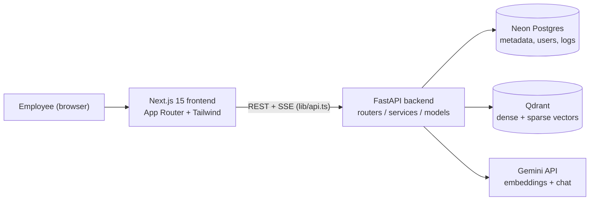
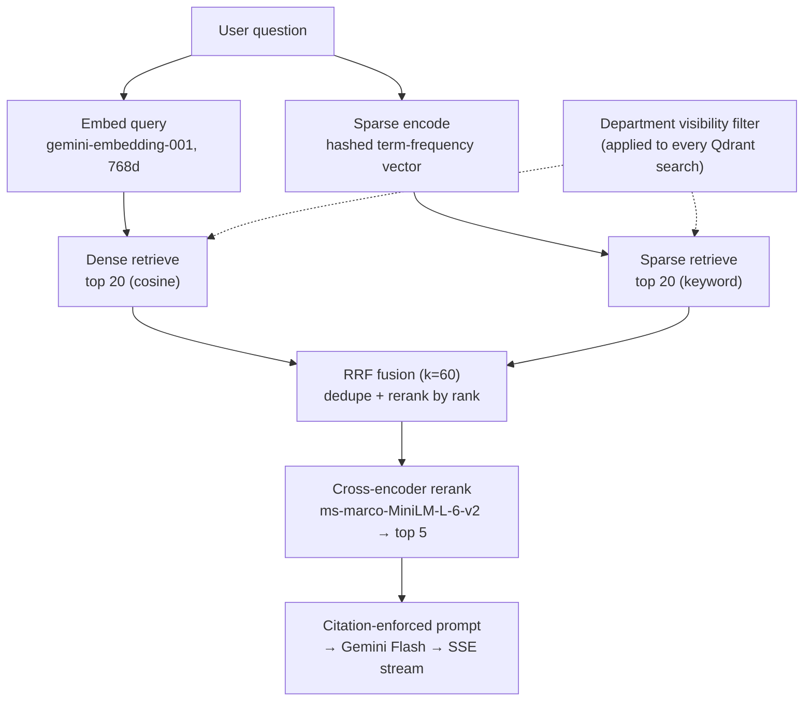

# Pragya · प्रज्ञा

**An enterprise RAG knowledge platform that answers questions with cited, source-grounded answers.**

[](https://www.python.org/)
[](https://fastapi.tiangolo.com/)
[](https://nextjs.org/)
[](https://qdrant.tech/)
[](https://neon.tech/)
[](https://ai.google.dev/)

<!-- TODO: Add a demo GIF or screenshot here.
     Recommended: a 1600×900 (16:9) screen capture of the landing page terminal
     demo typing a query and streaming a cited answer, or the chat view showing a
     trace line + citation chips. Place at docs/assets/demo.gif and reference it:
      -->

---

## What is Pragya?

Employees ask questions in plain language — *"How many casual leaves do I get?"* — and Pragya answers using **only** the documents their department is allowed to see, citing the exact source file and page behind every claim. It is not a generic chatbot: an HR user can never retrieve an answer from an IT document, and every response is traceable to `Filename.pdf · page N`.

Technically, Pragya combines **hybrid retrieval** (dense semantic + sparse keyword search fused with Reciprocal Rank Fusion and a cross-encoder reranker), **citation-enforced generation**, and **department-level access control enforced at the vector-database layer** rather than in application logic.

---

## Key Features

**Retrieval & RAG**
- Hybrid retrieval: dense semantic search + sparse keyword search, fused with **Reciprocal Rank Fusion (k=60)**, then re-scored by a **cross-encoder reranker** down to the top 5 parent chunks.
- Hierarchical chunking — retrieve on small **child chunks** (256 tokens) for precision, generate from large **parent chunks** (1024 tokens) for context.
- Citation-enforced generation — the model is prompted to ground every claim and answers stream token-by-token over **Server-Sent Events**.
- Asymmetric embedding — queries and documents are embedded with their correct task types (`retrieval_query` / `retrieval_document`) to avoid a common silent RAG quality drop.

**Document Intelligence**
- Auto-generated document summaries, key points, and action items.
- Semantic search across the documents a user is permitted to see.
- Meeting assistant — turn a transcript (pasted text or uploaded file) into a summary, decisions, and action items.

**Access & Security**
- **3-tier document visibility** — `company` (everyone), `department` (same department only), and `personal` (uploader only) — enforced as a single OR-of-tiers filter on every Qdrant query.
- JWT auth (email + password, bcrypt-hashed; no OAuth) with `admin` / `user` / `viewer` roles.
- Admin-only routes for user/role management and analytics.

**Product**
- Conversation history with multi-turn chat sessions.
- Analytics dashboard — top queries, unanswered questions, document usage, activity over time.
- Multi-format ingestion: **PDF, DOCX, PPTX** (page/slide numbers preserved).
- Light ("paper") / dark ("ink") themes following a documented design system (`DESIGN.md`).

---

## Architecture



**Request flow for a chat query.** The browser sends the question to `POST /chat/query` with a Bearer JWT. The backend resolves the user's `department_id` and `user_id` from the token and builds the RBAC visibility filter. The query is embedded, then retrieved against Qdrant (dense + sparse → RRF fusion → cross-encoder rerank), scoped by that filter so a user only ever sees permitted chunks. The top parent chunks are assembled into a citation-enforced prompt, sent to Gemini Flash, and the answer is streamed back over SSE. The query is logged to Postgres for analytics and evaluation.

---

## The Retrieval Pipeline

This is the technical core. Three retrieval strategies share a single entry point (`retrieve(query, user, method)`) so the app and the evaluation harness can switch between them with one argument.



- **Dense retrieval** — semantic similarity over 768-dim Gemini embeddings (cosine). Catches paraphrase and meaning even when no keyword matches.
- **Sparse retrieval** — a BM25-style keyword signal. Words are hashed into a fixed index space and weighted by term frequency (a lightweight BM25 *approximation*, not a learned sparse model). Catches exact tokens that embeddings miss — e.g. abbreviations like "CL" / "EL".
- **RRF fusion** — combines the two ranked lists by reciprocal rank (`1/(k+rank)`, `k=60`, the standard from Cormack et al., 2009), ignoring incomparable raw scores. Documents both retrievers agree on float to the top.
- **Cross-encoder rerank** — jointly scores each `(query, chunk)` pair and keeps the top 5 parent chunks for generation.

---

## Evaluation Results

Pragya was evaluated with **RAGAS** on the document corpus in `docs/` over **30 fixed test questions**, comparing the three retrieval strategies on two metrics. Source: `backend/evaluation/final_results.json`.

| Method | Faithfulness | Context Precision | Average |
|--------|:------------:|:-----------------:|:-------:|
| Dense only | 0.873 | 0.936 | 0.905 |
| **Hybrid (dense + sparse + RRF)** | **0.886** | 0.928 | **0.907** |
| Hybrid + Rerank | 0.750 | 0.900 | 0.825 |

**Findings.** Hybrid retrieval edges out dense-only on average (0.907 vs 0.905) — a thin but consistent margin, driven by better faithfulness. Adding the cross-encoder reranker *hurt* faithfulness noticeably (0.886 → 0.750): on a small, clean corpus, pruning to 5 chunks discards supporting context that the generator needed, so it over-prunes rather than refines. This is an honest, useful result — reranking is not free, and its value depends on corpus size and noise.

**Methodology — two independent judges.** The answers were *generated* by Gemini (`gemini-3.1-flash-lite`), but *graded* by separate models so the generator never grades its own output: **faithfulness** was judged by `qwen2.5:7b` running locally via Ollama, and **context precision** by `llama-3.1-8b-instant` via Groq. Decoupling the generator from the judges removes self-evaluation bias.

---

## Tech Stack

| Layer | Technology | Why |
|-------|-----------|-----|
| API framework | **FastAPI** (async, Python 3.11) | Async-first, automatic OpenAPI docs, fast to build typed endpoints. |
| ORM | **SQLAlchemy** (async) | Keeps DB logic in Python; async to match the API. |
| Migrations | **Alembic** | Versioned schema, autogenerated from models. |
| Primary DB | **Neon** (serverless Postgres) | Cloud Postgres for metadata, users, chat history, query logs. |
| Vector DB | **Qdrant** | Native hybrid search — one collection holds both dense and sparse named vectors. |
| Embeddings | **gemini-embedding-001** (768d) | 768 dims via Matryoshka truncation keeps the index small with negligible quality loss. |
| Chat LLM | **Gemini Flash** (model string from config) | Fast, low-cost generation; the exact model is `GEMINI_CHAT_MODEL`, never hardcoded. |
| Reranker | **cross-encoder/ms-marco-MiniLM-L-6-v2** | ~85MB sentence-transformers model; runs locally, no API cost. |
| Frontend | **Next.js 15** (App Router) + Tailwind + SWR | Server components, streaming-friendly, client-side caching for snappy UX. |
| Auth | **JWT** (`python-jose`) + **bcrypt** (`passlib`) | Stateless, email + password only — no OAuth dependency. |

---

## Getting Started

### Option A — Docker (recommended)

**Prerequisites:** Docker + Docker Compose, a [Neon](https://neon.tech/) Postgres connection string, and a [Google AI Studio](https://ai.google.dev/) Gemini API key.

```bash
cp .env.example .env       # then fill in DATABASE_URL, GEMINI_API_KEY,
                           # GEMINI_CHAT_MODEL, and SECRET_KEY
docker compose up --build
```

This starts three services: **Qdrant**, the **FastAPI backend**, and the **Next.js frontend**. (Neon Postgres is *not* containerized — the backend reaches it over `DATABASE_URL`.)

| Service | URL |
|---------|-----|
| Frontend | http://localhost:3000 |
| API docs (Swagger) | http://localhost:8000/docs |
| Health check | http://localhost:8000/health |
| Qdrant dashboard | http://localhost:6333/dashboard |

### Option B — Manual (development)

**1. Qdrant** (vector DB, via Docker):
```bash
docker run -p 6333:6333 -p 6334:6334 qdrant/qdrant:latest
```

**2. Backend** (`.env` lives at the repo root; Alembic and uvicorn run from `backend/`):
```bash
cd backend
python -m venv venv
source venv/bin/activate
pip install -r requirements.txt
alembic upgrade head           # apply migrations to Neon
uvicorn main:app --reload      # serves http://localhost:8000
```
> The app also auto-creates tables on startup in development (`checkfirst`), so it boots even before migrations — but `alembic upgrade head` is the source of truth for schema.

**3. Frontend:**
```bash
cd frontend
npm install
npm run dev                     # serves http://localhost:3000
```

---

## Environment Variables

Copy `.env.example` to `.env` and fill in the values. Docker Compose reads `.env` directly.

| Variable | Description | Required |
|----------|-------------|:--------:|
| `DATABASE_URL` | Neon Postgres URL. Must use the `postgresql+asyncpg://` driver prefix and `?ssl=require`. | ✅ |
| `QDRANT_URL` | Qdrant endpoint. `http://localhost:6333` for host dev; auto-overridden to `http://qdrant:6333` under Compose. | Default |
| `QDRANT_COLLECTION` | Vector collection name (dense 768d + sparse). | Default `pragya_docs` |
| `GEMINI_API_KEY` | Google AI Studio key for embeddings + chat. | ✅ |
| `GEMINI_EMBEDDING_MODEL` | Embedding model. | Default `gemini-embedding-001` |
| `GEMINI_CHAT_MODEL` | Chat/generation model string (confirm exact name in AI Studio). | ✅ |
| `SECRET_KEY` | 64-char hex used to sign JWTs. Generate with `python -c "import secrets; print(secrets.token_hex(32))"`. | ✅ |
| `ALGORITHM` | JWT signing algorithm. | Default `HS256` |
| `ACCESS_TOKEN_EXPIRE_HOURS` | JWT lifetime in hours. | Default `8` |
| `GROQ_API_KEY` | Independent judge LLM — **evaluation only**. App boots fine without it. | Eval-only |
| `GROQ_API_KEY_2`, `GROQ_API_KEY_3` | Extra Groq keys for separate daily token budgets during eval. | Eval-only |
| `APP_ENV` | `development` or `production`. | Default `development` |

---

## Project Structure

```
pragya/
├── backend/                     # FastAPI server (3-layer: routers → services → models)
│   ├── routers/                 # HTTP only: auth, documents, chat, intelligence,
│   │                            #   analytics, meeting, admin, departments
│   ├── services/                # Business logic
│   │   ├── retrieval_service.py #   ← the RAG core: dense/sparse/RRF/rerank
│   │   ├── generation_service.py#   citation-enforced prompt + Gemini streaming
│   │   ├── ingestion_service.py #   parse → clean → chunk → embed → upsert
│   │   ├── intelligence_service.py
│   │   └── meeting_service.py
│   ├── models/                  # SQLAlchemy ORM (UUID PKs)
│   ├── evaluation/              # RAGAS harness + final_results.json
│   ├── qdrant.py                # Qdrant client + RBAC visibility filter
│   ├── config.py                # pydantic-settings (.env) — no hardcoded secrets
│   ├── alembic/                 # migrations
│   └── main.py                  # app entrypoint + startup lifecycle
│
├── frontend/                    # Next.js 15 (App Router)
│   ├── app/                     # routes: landing, login, (app)/chat, documents,
│   │                            #   conversations, meeting, admin
│   ├── components/              # landing/, chat/, documents/, ui/
│   └── lib/                     # api.ts (the only DB boundary), auth, hooks
│
├── docs/                        # sample corpus + technical report
├── paper/                       # IEEE-style research paper (LaTeX)
├── docker-compose.yml           # Qdrant + backend + frontend
├── CLAUDE.md / DESIGN.md        # architecture + design system
└── .env.example
```

---

## Research

Pragya doubles as a controlled study of retrieval strategies. The same corpus and a fixed question set are run through three pipelines — **dense-only**, **hybrid (dense + sparse + RRF)**, and **hybrid + reranker** — and scored with RAGAS using two independent judge LLMs. The write-up exists as an IEEE-style conference paper ([`paper/pragya_paper.tex`](paper/pragya_paper.tex)) and a full technical report ([`docs/PRAGYA_TECHNICAL_REPORT.tex`](docs/PRAGYA_TECHNICAL_REPORT.tex), with a Markdown version alongside it).

---

## Roadmap / Future Work

- **Larger, noisier corpus.** The current eval (30 questions, ~7 clean documents) favors simple retrieval; reranking should pay off as the corpus grows. Re-run at scale.
- **Learned sparse vectors.** Replace the hashed term-frequency BM25 *approximation* with SPLADE or FastEmbed BM25 for a true learned sparse signal.
- **Uniform-K evaluation.** Compare strategies at a fixed retrieval depth so the reranker's pruning is isolated from the candidate-pool size.
- **More metrics.** Add answer relevancy and Recall@K alongside faithfulness and context precision.
- **Production hardening.** Tighten CORS to real origins, externalize schema management fully to Alembic, and add rate limiting around the Gemini free-tier budget.

---

**Author:** Yasharth Singh <!-- TODO: add GitHub / LinkedIn / email links -->
