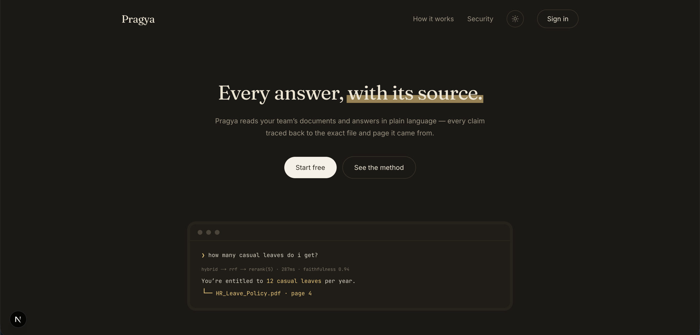

# Pragya (प्रज्ञा) — Enterprise RAG Knowledge Platform

**Pragya** is an internal AI knowledge assistant that reads your organization's documents and answers questions in natural language, with citations to the exact source file and page.

Employees ask questions like "How many casual leaves do I get?" and get answers grounded in your HR documents, with full traceability.

## Features

- **Hybrid retrieval** — combines dense semantic search (Gemini embeddings) with sparse BM25 keyword search for precise answers
- **Full citations** — every answer includes the source file and page number
- **Department-level access control** — enforced at the vector-database layer; users only see answers from their department's documents
- **Multi-format support** — ingests PDFs, Word documents, and slide decks with page numbers preserved

## Latest changes

- Commit `e994b3a` — Feat: Add Landing Page (Yasharth Singh, 2026-06-10)
   - Added a Next.js landing page under `frontend/` (app routes, components, and static assets).
   - Added a minimal FastAPI backend scaffold under `backend/` (`config.py`, `database.py`, `qdrant.py`, `main.py`, `models/`, and `requirements.txt`).
   - Added project-level `.gitignore` and a `frontend/README.md` with Next.js instructions.

Quick start notes for these additions:

- Frontend (Next.js)
```bash
cd frontend
npm install
npm run dev
```

- Backend (FastAPI)
```bash
cd backend
python -m venv venv
source venv/bin/activate
pip install -r requirements.txt
python -m uvicorn main:app --reload
```

- Qdrant (vector DB)
```bash
docker run -p 6333:6333 qdrant/qdrant:latest
```

See `frontend/README.md` for Next-specific notes and `backend/requirements.txt` for backend dependencies.

## Screenshots



## Tech Stack

| Layer | Tech |
|-------|------|
| **Frontend** | Next.js 15 (App Router), React 19, TypeScript, Tailwind CSS v4 |
| **Backend** | FastAPI, Python 3.11 (async), SQLAlchemy ORM, Alembic migrations |
| **Database** | Neon DB (serverless PostgreSQL) |
| **Vector DB** | Qdrant (hybrid search) |
| **Embeddings** | Gemini embedding-001 (768 dims) |
| **LLM** | Gemini Flash (chat) |
| **Reranker** | cross-encoder/ms-marco-MiniLM-L-6-v2 |
| **Auth** | JWT + bcrypt (email/password, no OAuth) |

## Getting Started

### Prerequisites

- Node.js 18+ & npm
- Python 3.11+
- Docker (for Qdrant)
- Google AI API key (for embeddings & chat)
- Neon DB connection string

### Setup

1. **Clone & install**
   ```bash
   git clone <repo-url>
   cd pragya
   
   # Frontend
   cd frontend && npm install && cd ..
   
   # Backend
   cd backend && python -m venv venv && source venv/bin/activate && pip install -r requirements.txt
   ```

2. **Environment**
   - Copy `.env.example` to `.env`
   - Add your `NEON_DATABASE_URL`, `GEMINI_API_KEY`, and other secrets

3. **Start Qdrant** (Docker)
   ```bash
   docker run -p 6333:6333 qdrant/qdrant:latest
   ```

4. **Run the backend**
   ```bash
   cd backend && source venv/bin/activate && python -m uvicorn main:app --reload
   ```
   The API runs at `http://localhost:8000`. OpenAPI docs at `http://localhost:8000/docs`.

5. **Run the frontend**
   ```bash
   cd frontend && npm run dev
   ```
   The site runs at `http://localhost:3000`.

## Project Structure

```
pragya/
├── frontend/          # Next.js landing page + app
│   ├── app/          # Pages (layout, page routes)
│   ├── components/   # Reusable UI components
│   │   └── landing/  # Landing page sections (Nav, Hero, etc.)
│   ├── public/       # Static assets
│   └── package.json
│
├── backend/          # FastAPI server
│   ├── models/       # SQLAlchemy ORM definitions
│   ├── routers/      # HTTP route handlers
│   ├── services/     # Business logic (ingestion, RAG, etc.)
│   ├── main.py       # FastAPI app entrypoint
│   └── requirements.txt
│
├── CLAUDE.md         # Internal architecture docs (for developers)
├── DESIGN.md         # Design system & component specs
└── README.md         # This file
```

## Development

- **Frontend**: See `frontend/` for Next.js setup and component structure
- **Backend**: FastAPI follows a 3-layer pattern:
  - `routers/` — HTTP validation & response
  - `services/` — business logic
  - `models/` — database access

### Building

- **Frontend**: `npm run build` (production build at `frontend/.next`)
- **Backend**: See migrations via `alembic` in the backend directory

### Tests

- Backend health check: `curl http://localhost:8000/health`
- Frontend: Runs via `npm run dev` or `npm run build`

## Design System

The UI follows a **serif + mono + sans** voice:
- **Serif** (Fraunces) — headlines, wisdom voice
- **Sans** (Inter) — body, UI
- **Mono** (JetBrains Mono) — terminal, metadata, machinery

Theme modes: light ("paper") and dark ("ink").