# Pragya — Technical Report

### प्रज्ञा · "Wisdom"
### An Enterprise Retrieval-Augmented Generation (RAG) Knowledge Platform

---

| | |
|---|---|
| **Project** | Pragya — Enterprise RAG Knowledge Platform |
| **Organization** | HCL Infosystems |
| **Engagement** | Internship Technical Project (6-week timeline) |
| **Author** | Yasharth Singh |
| **Document type** | Master technical reference & internship technical report |
| **Status** | Working system — backend, frontend, and evaluation harness complete |
| **Backend** | FastAPI (async, Python 3.11) · Neon PostgreSQL · Qdrant · Gemini |
| **Frontend** | Next.js 15 (App Router) · Tailwind CSS v4 |
| **Document version** | 1.0 |

---

> **A note on this document.** This is the master technical reference for Pragya. It
> doubles as the technical report for the HCL Infosystems internship and as the
> author's own engineering documentation. Every technical claim, number, file path,
> function name, and formula in it is taken from the real source code and the real
> evaluation results, not from the project plan. Where the implemented code diverges
> from the original specification, the divergence is called out explicitly rather than
> smoothed over — a technical report is only useful if it describes the system that was
> actually built. Items that could not be verified from code are marked `[VERIFY]`.

---

## Table of Contents

1. [Abstract](#abstract)
2. [Document Purpose & How to Read It](#document-purpose--how-to-read-it)
3. [Executive Summary](#executive-summary-non-technical)
4. [System Overview](#1-system-overview)
   - 1.1 [What Pragya Is](#11-what-pragya-is)
   - 1.2 [The Problem It Solves](#12-the-problem-it-solves)
   - 1.3 [Who Uses It — Users & Roles](#13-who-uses-it--users--roles)
   - 1.4 [The Three Defining Features](#14-the-three-defining-features)
   - 1.5 [Technology Stack & Justification](#15-technology-stack--justification)
   - 1.6 [Top-Level System Architecture](#16-top-level-system-architecture)
5. [Data Model & Ingestion Pipeline](#2-data-model--ingestion-pipeline)
   - 2.1 [The Relational Schema — Seven Tables](#21-the-relational-schema--seven-tables)
   - 2.2 [Entity-Relationship Diagram](#22-entity-relationship-diagram)
   - 2.3 [The Ingestion Pipeline, End to End](#23-the-ingestion-pipeline-end-to-end)
   - 2.4 [Parsing & Boilerplate Stripping](#24-parsing--boilerplate-stripping)
   - 2.5 [Hierarchical Chunking — The Math](#25-hierarchical-chunking--the-math)
   - 2.6 [Embedding — Gemini & Matryoshka](#26-embedding--gemini--matryoshka)
   - 2.7 [The Qdrant Collection](#27-the-qdrant-collection)
   - 2.8 [The Sparse Channel & Its Honest Limitations](#28-the-sparse-channel--its-honest-limitations)
6. [Retrieval Pipeline — The Research Core](#3-retrieval-pipeline--the-research-core)
   - 3.1 [The Full Query Pipeline](#31-the-full-query-pipeline)
   - 3.2 [Dense Retrieval — Cosine Similarity](#32-dense-retrieval--cosine-similarity)
   - 3.3 [Sparse Retrieval — BM25-Style Keyword Matching](#33-sparse-retrieval--bm25-style-keyword-matching)
   - 3.4 [RRF Fusion — Formula & Worked Example](#34-rrf-fusion--formula--worked-example)
   - 3.5 [Cross-Encoder Reranking](#35-cross-encoder-reranking)
   - 3.6 [The Three Methods as Configurations](#36-the-three-methods-as-configurations)
7. [Generation, Citations & Access Control](#4-generation-citations--access-control)
   - 4.1 [Citation-Enforced Generation](#41-citation-enforced-generation)
   - 4.2 [Parent Deduplication Before Generation](#42-parent-deduplication-before-generation)
   - 4.3 [SSE Streaming & Turn Persistence](#43-sse-streaming--turn-persistence)
   - 4.4 [The 3-Tier Visibility Model](#44-the-3-tier-visibility-model)
   - 4.5 [JWT Authentication & the RBAC Dependency Chain](#45-jwt-authentication--the-rbac-dependency-chain)
8. [Feature Modules](#5-feature-modules)
   - 5.1 [Auth & Onboarding](#51-auth--onboarding)
   - 5.2 [Document Intelligence](#52-document-intelligence)
   - 5.3 [Meeting Assistant](#53-meeting-assistant)
   - 5.4 [Document Search](#54-document-search)
   - 5.5 [Conversation History](#55-conversation-history)
   - 5.6 [Analytics Dashboard](#56-analytics-dashboard)
   - 5.7 [Admin Panel](#57-admin-panel)
9. [Frontend Architecture](#6-frontend-architecture)
   - 6.1 [Next.js 15 App Router Structure](#61-nextjs-15-app-router-structure)
   - 6.2 [The Design System — Ink, Paper, Amber](#62-the-design-system--ink-paper-amber)
   - 6.3 [The API Layer & SWR Caching](#63-the-api-layer--swr-caching)
   - 6.4 [Key Screens & Their Data Flows](#64-key-screens--their-data-flows)
10. [Evaluation & Research](#7-evaluation--research)
    - 7.1 [RAGAS Methodology](#71-ragas-methodology)
    - 7.2 [The 30-Question Benchmark Set](#72-the-30-question-benchmark-set)
    - 7.3 [The Two-Independent-Judge Design](#73-the-two-independent-judge-design)
    - 7.4 [Results](#74-results)
    - 7.5 [Honest Findings & Limitations](#75-honest-findings--limitations)
11. [Engineering Journey & Appendices](#8-engineering-journey--appendices)
    - 8.1 [The Chronological Build & Key Bugs](#81-the-chronological-build--key-bugs)
    - 8.2 [Known Limitations & Future Work](#82-known-limitations--future-work)
    - 8.3 [Deployment Notes](#83-deployment-notes)
    - 8.4 [Appendix A — API Endpoint Reference](#84-appendix-a--api-endpoint-reference)
    - 8.5 [Appendix B — Glossary](#85-appendix-b--glossary)
    - 8.6 [Appendix C — Markdown → LaTeX/PDF Conversion Plan](#86-appendix-c--markdown--latexpdf-conversion-plan)

---

## Abstract

Pragya is an internal AI knowledge assistant for an organization. Employees ask
questions in natural language — *"How many casual leaves do I get?"* — and receive
answers grounded in their department's own documents, with a citation to the exact
source file and page behind every factual claim. It is not a generic chatbot bolted
onto a search box; it is a purpose-built **Retrieval-Augmented Generation (RAG)**
platform whose design choices are made to maximize answer faithfulness and to keep
each department's documents walled off from the others.

Three properties define the system. First, **hybrid retrieval**: every question is
answered by combining dense semantic search (vector embeddings) with sparse keyword
search (a BM25-style signal), fused by Reciprocal Rank Fusion, rather than relying on
embeddings alone. Second, **citation grounding**: the language model is instructed to
answer *only* from retrieved context and to cite each claim as `[Source: N]`, which is
then resolved back to a real filename and page number — an answer can only cite
material the system actually retrieved. Third, **department-level access control
enforced at the vector-database query layer**: a Human Resources user can never
retrieve an Information Technology document, because the access boundary is applied
inside the Qdrant query itself, not in application code that could be bypassed.

Beyond the product, Pragya carries a small **research contribution**: a controlled
comparison of three retrieval configurations — dense-only, hybrid, and hybrid +
cross-encoder reranking — over one fixed corpus and thirty ground-truth questions,
scored with the RAGAS framework using two independent judge models so the generator
never grades its own output. The results, reported in full and without selection
later in this document, are quietly instructive: the hybrid configuration scores
highest on average, and adding a reranker actually *degrades* faithfulness on this
corpus. Reporting that honestly — rather than assuming "more pipeline is better" — is
part of the engineering value of the project.

---

## Document Purpose & How to Read It

This report serves three readers, and is structured so each can find what they need:

- **An HCL manager or non-technical reviewer** should read the [Executive
  Summary](#executive-summary-non-technical) and Section [1.1–1.4](#11-what-pragya-is).
  These describe what the system does, the problem it solves, and why it matters, with
  no code or mathematics.
- **An engineer or technical reviewer** will find the depth in Sections 2 onward: the
  data model, the retrieval mathematics, the generation and access-control mechanisms,
  every feature module, the frontend, and the evaluation methodology — each grounded
  in the actual implementation with file and function references.
- **A graduate-school or research reviewer** should focus on the retrieval core
  (Section 3) and the evaluation (Section 7), which together constitute the
  controlled-comparison contribution.

**Conventions used throughout:**

- **Diagrams** are written as [Mermaid](https://mermaid.js.org/) code blocks. They
  render directly on GitHub and convert cleanly to PDF.
- **Formulas** appear in fenced math blocks using LaTeX-style notation, with the
  *actual constants from the code* (for example, the RRF constant `k = 60`).
- **Code references** are given as `file_path` and `function_name()` so any claim can
  be checked against the source.
- **`[VERIFY]`** marks anything that could not be confirmed directly from code.
- **Divergence callouts** (boxed quotes) flag places where the implementation differs
  from the original `CLAUDE.md` specification.

---

## Executive Summary (non-technical)

**The problem.** Every organization accumulates a large body of internal knowledge —
HR leave policies, IT security rules, finance reimbursement limits, engineering
handbooks, onboarding guides. This knowledge is scattered across documents that
employees rarely read in full. So the same questions get asked over and over —
*"How many casual leaves do I get?"*, *"What's the daily meal limit on travel?"*,
*"Who approves an expense above fifty thousand?"* — and the answers consume the time
of HR, IT, and finance staff, or worse, go unanswered and lead to mistakes. A generic
AI chatbot does not fix this: it will answer confidently from general knowledge of the
internet, not from *this* company's actual policies, and it cannot show you where its
answer came from.

**What Pragya does.** Pragya is a private, internal assistant that answers employee
questions using only the organization's own documents. An employee types a question in
plain language and gets a direct answer — and, crucially, every fact in that answer
carries a citation to the precise document and page it came from. If the answer is not
in the documents, Pragya says so plainly instead of inventing one. Each department's
documents stay private to that department: an answer for an HR employee is built only
from material that HR employee is allowed to see.

**Why it is trustworthy.** Two design decisions make Pragya safe to rely on. It is
built to *refuse to guess* — the underlying AI is constrained to use only the retrieved
company documents and to admit when it has no grounding. And every answer is
*traceable* — the citations let any employee verify the source for themselves in one
click. This is the difference between "an AI told me" and "the HR Leave Policy, page 4,
says so."

**What was built.** A complete, working system: a secure backend that ingests PDF,
Word, and PowerPoint documents and makes them searchable; a retrieval engine that
combines two complementary search methods for better recall; a citation-grounded
answer generator that streams responses live; a clean, calm web interface; document
summarization and a meeting-notes assistant as value-adds; an analytics dashboard for
administrators; and a rigorous evaluation showing measured answer quality. The
platform additionally produced a small research result comparing retrieval strategies,
of the kind suitable for an academic venue.

**The honest bottom line.** Measured on a thirty-question benchmark against the
company corpus, Pragya's answers score around **0.87–0.94 on faithfulness** (how well
the answer sticks to its sources) and **0.90–0.94 on context precision** (how relevant
the retrieved material is) depending on configuration — strong numbers for a system of
this size. The evaluation also surfaced a counter-intuitive finding worth stating
plainly: the most elaborate retrieval pipeline was *not* the best one, which is exactly
the kind of result a careful engineering study exists to find.

---

## 1. System Overview

### 1.1 What Pragya Is

Pragya is an **Enterprise RAG Knowledge Platform** — a web application that lets the
employees of an organization query their internal documents in natural language and
receive grounded, cited answers. The name (प्रज्ञा, Sanskrit for *wisdom*) reflects the
product's character: it reads the organization's documents and answers from them with
sources, rather than improvising.

Architecturally, Pragya is two cooperating systems:

- A **Python/FastAPI backend** that handles authentication, document ingestion,
  vector search, answer generation, and analytics. It is fully asynchronous, organized
  into a strict three-layer structure (routing → services → data), and backed by a
  cloud PostgreSQL database (Neon) for relational data and a Qdrant vector database for
  semantic search.
- A **Next.js 15 frontend** that provides the chat interface, document management,
  conversation history, the meeting assistant, and the admin dashboard. The frontend
  never touches a database directly; it communicates only through the backend's HTTP
  API.

The system was built as a six-week internship project at HCL Infosystems, following a
deliberate module-by-module build order (foundation → auth → ingestion → RAG chat →
document intelligence → conversation history → analytics → meeting assistant), with
each module tested and committed before the next began.

### 1.2 The Problem It Solves

Organizational knowledge has three chronic failure modes that Pragya is designed to
address:

1. **Knowledge is locked in documents nobody fully reads.** Policies and handbooks are
   long; the answer to a specific question is one sentence buried on page 14. Employees
   either ask a colleague (consuming that colleague's time) or guess.

2. **Generic AI assistants are confidently wrong about company specifics.** A
   general-purpose chatbot will happily state a "typical" casual-leave allowance that
   has nothing to do with *this* company's actual policy. Worse, it cannot cite a
   source, so the user has no way to tell a real answer from a fabricated one — the
   *hallucination* problem.

3. **Sensitive documents must not leak across departments.** Finance, Legal, and HR
   hold material that other departments should not see. A naïve "search everything"
   assistant is a data-governance hazard.

Pragya addresses all three at once. It grounds answers in the *actual* corpus
(addressing #1 and #2), enforces the hallucination guard at the prompt level and
surfaces citations for verification (#2), and enforces per-department access control at
the vector-database query layer so the access rule cannot be bypassed by application
logic (#3).

### 1.3 Who Uses It — Users & Roles

Pragya recognizes three roles, stored on the `users.role` column and carried in every
authentication token. The role is a plain string (not a database enum) so new roles can
be introduced without a schema migration.

| Role | Who they are | What they can do |
|------|-------------|------------------|
| **`admin`** | Department or org administrators | Everything a user can, **plus**: manage departments, change user roles, upload **company-wide** documents, access any department's department-level documents, and view the analytics dashboard. The very first user to register is automatically promoted to `admin` to bootstrap the organization. |
| **`user`** | Regular employees | Ask questions in chat, upload documents (to their own department or as personal), use document intelligence and the meeting assistant, search documents, and review their own conversation history. |
| **`viewer`** | Read-oriented accounts | A lighter role available in the role model; gated the same way as `user` for queries. |

Every user belongs to **at most one department** (`users.department_id`, nullable). The
department is the backbone of access control: it determines which documents a user's
queries can reach. A user with no department cannot query documents at all — there is
no access boundary to scope them to — and the chat endpoint rejects such a request with
a clear error.

Administrators are gated by a dedicated dependency, `require_admin()`, layered on top of
the normal authentication dependency. A logged-in non-admin who calls an admin route
receives a `403 Forbidden` (authenticated but not authorized), distinct from the `401`
an anonymous caller would get.

### 1.4 The Three Defining Features

Pragya is deliberately *not* a generic chatbot. Three features distinguish it, and the
rest of this report is largely an elaboration of how each is implemented.

**1. Hybrid retrieval (dense + sparse), not dense-only.**
Most simple RAG systems embed the question into a vector and find the nearest document
vectors — *dense* semantic retrieval. This is excellent at meaning ("annual vacation"
≈ "yearly leave") but blind to exact tokens: an abbreviation like "CL" (casual leave)
has no useful embedding neighborhood. Pragya runs dense retrieval **and** a sparse
keyword retrieval in parallel and fuses the two ranked lists with **Reciprocal Rank
Fusion (RRF)**. A document that ranks well in *both* methods rises to the top — and
agreement between two different retrieval systems is a strong relevance signal. (The
honest state of the sparse channel in the current build is documented in Section 2.8;
it is implemented and wired through the whole pipeline, with a known indexing defect
that the evaluation later exposes.)

**2. Citation grounding on every answer.**
The generation prompt instructs the model to answer *only* from the provided context
blocks, to cite every factual claim as `[Source: N]`, and — if the answer is not
present — to return a fixed refusal string verbatim. After the answer streams out, a
parser resolves each `[Source: N]` back to the real filename and page from the
retrieved chunk's metadata. The result is that citations are *enforceable and
checkable*: a citation can only point to a block the system actually retrieved, which
is precisely what makes faithfulness measurable.

**3. Department-level access control at the vector-DB layer.**
Access control is not an afterthought applied to results; it is a filter built into
every Qdrant query. Before any vector is scored, a *visibility filter* restricts the
search to documents the caller may see, under a three-tier model (company-wide /
department / personal). Because the filter is part of the query, there is no code path
that retrieves a forbidden document and then tries to hide it — the forbidden document
is never a candidate in the first place.

### 1.5 Technology Stack & Justification

Every technology choice below was made deliberately and, per the project's engineering
discipline, recorded in configuration rather than hardcoded. The table summarizes the
stack; the prose that follows justifies the non-obvious choices. Versions are taken
from `backend/requirements.txt` and `frontend/package.json`.

| Layer | Choice | Version (pinned) | Why |
|-------|--------|------------------|-----|
| **API framework** | FastAPI (async) | `~=0.115` | Native async, automatic OpenAPI `/docs`, Pydantic validation built in. |
| **Language / runtime** | Python | 3.11 | Mature AI/ML ecosystem; async maturity. |
| **ASGI server** | Uvicorn `[standard]` | `~=0.34` | uvloop + httptools for speed. |
| **ORM** | SQLAlchemy `[asyncio]` | `~=2.0` | Async ORM; DB logic stays in Python, not raw SQL. |
| **Migrations** | Alembic | `~=1.14` | Autogenerated migrations diffed from models. |
| **Relational DB** | Neon (serverless PostgreSQL) | cloud | Serverless Postgres, scales to zero, SSL-required. |
| **Postgres driver** | asyncpg | `~=0.30` | Fast async driver SQLAlchemy speaks to. |
| **Vector DB** | Qdrant (local, Docker) | client `~=1.12` | Native hybrid search: named dense **and** sparse vectors in one collection. |
| **Embeddings** | Gemini `gemini-embedding-001` @ 768-d | SDK `~=0.8` | Strong embeddings; Matryoshka truncation 3072→768 keeps the index small. |
| **Chat LLM** | Gemini Flash (model from config) | SDK `~=0.8` | Fast, free-tier-friendly; exact model string lives in `.env`. |
| **Reranker** | `cross-encoder/ms-marco-MiniLM-L-6-v2` | sentence-transformers `~=3.3` | Joint query-document scoring; runs locally (~85 MB). |
| **PDF parsing** | PyMuPDF (`fitz`) | `~=1.25` | Keeps page numbers — citations depend on them. |
| **DOCX / PPTX** | python-docx / python-pptx | `~=1.1` / `~=1.0` | Native Office parsing. |
| **Auth** | python-jose (JWT) + passlib (bcrypt) | `~=3.3` / `~=1.7` | Email + password only, no OAuth; bcrypt pinned to `4.0.1` for passlib compatibility. |
| **Config** | pydantic-settings | `~=2.7` | Typed settings loaded from `.env`; no secrets in code. |
| **Frontend** | Next.js 15 (App Router) + React 19 | `15.5.19` / `19.1.0` | Server components, file routing, modern React. |
| **Styling** | Tailwind CSS v4 | `^4` | Token-driven utility CSS; design system as CSS variables. |
| **Client caching** | SWR | `^2.4.1` | Cache-first reads with background revalidation. |
| **Charts** | Recharts | `^3.8.1` | Analytics dashboard visualizations. |
| **Evaluation** | RAGAS | `==0.2.0` | RAG-specific metrics (faithfulness, context precision). |
| **Eval judges** | Groq (`llama-3.1-8b-instant`) + local Ollama (`qwen2.5:7b`) | — | Independent judges so the generator never grades itself. |

**Why FastAPI + async everywhere.** RAG is I/O-bound: a single question waits on
embedding API calls, vector-database searches, the relational database, and a streaming
LLM response. An asynchronous framework lets the server handle other requests during
those waits instead of blocking a thread per request. FastAPI also gives automatic
interactive API documentation (`/docs`), which made each module testable the moment it
was built — a requirement in the project's definition of done.

**Why Neon for the relational database.** Neon is serverless PostgreSQL: standard
Postgres semantics (so SQLAlchemy and Alembic work unchanged) but managed, cloud-hosted,
and able to scale to zero — appropriate for a project that is not continuously loaded.
It requires SSL and closes idle connections, which the backend accounts for with
`pool_pre_ping=True` (re-checks a connection before use) and an explicit SSL connect
argument.

**Why Qdrant for vectors — and specifically Qdrant.** The defining feature is *hybrid*
retrieval, and Qdrant supports **named vectors**: a single collection can hold a dense
vector *and* a sparse vector per point, and can be queried against either by name. This
makes dense + sparse a first-class capability of the store rather than something
stitched together across two systems. Qdrant also supports payload filtering with
indexed fields, which is exactly what the department/visibility access control needs —
the access filter is a query-time payload filter, indexed for O(1) lookup.

**Why Gemini embeddings at 768 dimensions.** `gemini-embedding-001` natively produces
3072-dimensional vectors. Pragya truncates them to **768** using *Matryoshka*
representation (the model is trained so that a prefix of the vector is itself a valid,
high-quality embedding). The result is a much smaller, faster vector index at
negligible quality cost. The dimension is a configuration value
(`GEMINI_EMBEDDING_DIMENSIONS = 768`), and it must match on both the ingestion and query
sides or the vector store rejects the search.

**Why a cross-encoder reranker.** Dense and sparse retrieval are *bi-encoders* — query
and document are embedded independently and compared by a cheap distance. A
*cross-encoder* feeds the full (query, document) pair through a transformer together, so
attention can relate every query token to every document token. This is far more
accurate but far more expensive, so it is run only on the ~40 fused candidates, never
the whole corpus. (Whether this extra stage *helps* on Pragya's corpus is an empirical
question the evaluation answers — see Section 7.)

**Why JWT + bcrypt and no OAuth.** The spec calls for email + password authentication
only. Passwords are hashed with bcrypt (salt generated and stored inside the hash);
sessions are stateless JSON Web Tokens carrying the user id, department, and role, so
most requests authorize without a database hit. `bcrypt` is pinned to `4.0.1` because
passlib 1.7.4 crashes on bcrypt ≥ 4.1 — a real compatibility bug documented in the
engineering journey (Section 8).

> **Divergence callout — chat model name.** `CLAUDE.md` specifies "Gemini Flash — model
> string from config" and deliberately does not hardcode a model. The committed
> evaluation results (`backend/evaluation/final_results.json`) record the generator
> used for the benchmark as **`gemini-3.1-flash-lite`**. This report uses that real,
> recorded value wherever a concrete model name is needed, and treats the configurable
> `GEMINI_CHAT_MODEL` as the source of truth in the running system.

### 1.6 Top-Level System Architecture

At the highest level, Pragya is a browser client talking to a FastAPI backend, which in
turn orchestrates three external systems: the Neon relational database (identity,
documents, conversations, analytics), the Qdrant vector database (semantic + keyword
search with access filtering), and Google's Gemini APIs (embeddings and chat
generation). A local cross-encoder model provides reranking in-process.

```mermaid
flowchart TB
    subgraph Client["Browser — Next.js 15 frontend"]
        UI["Chat · Documents · Conversations<br/>Meeting · Admin · Analytics"]
    end

    subgraph Backend["FastAPI backend (async, 3-layer)"]
        direction TB
        R["routers/<br/><i>HTTP only</i>"]
        S["services/<br/><i>business logic</i>"]
        M["models/<br/><i>ORM / data access</i>"]
        MW["middleware/rbac<br/><i>JWT auth + role gates</i>"]
        R --> S --> M
        R -.auth.-> MW
    end

    subgraph External["External & local systems"]
        PG[("Neon PostgreSQL<br/>identity · docs · chats · logs")]
        QD[("Qdrant<br/>dense + sparse vectors<br/>+ visibility filter")]
        GEM["Gemini APIs<br/>embeddings + chat (SSE)"]
        RR["Cross-encoder reranker<br/>ms-marco-MiniLM (in-process)"]
    end

    UI -- "HTTPS / JSON · Bearer JWT<br/>(lib/api.ts)" --> R
    UI <-. "SSE token stream" .- R

    M --> PG
    S -- "vector search<br/>(RBAC-filtered)" --> QD
    S -- "embed / generate" --> GEM
    S -- "rerank top candidates" --> RR
```

**Reading the diagram.** A request enters through a router, which does HTTP work only —
validate input, enforce authentication via the RBAC middleware, call a service, return
a response. Services hold all logic: ingestion, retrieval, generation, intelligence.
The data layer (models) is the only thing that touches PostgreSQL. Vector search,
embedding, generation, and reranking are service-layer concerns that reach out to
Qdrant, Gemini, and the local reranker respectively. The frontend speaks to the backend
exclusively over HTTP/JSON with a bearer token, and receives streamed answers back over
Server-Sent Events. This separation — and the rule that the access filter lives inside
the Qdrant query — is the structural backbone the rest of this report details.

---

## 2. Data Model & Ingestion Pipeline

This section describes how Pragya stores knowledge — both the relational records in
PostgreSQL and the vectors in Qdrant — and how a raw uploaded file becomes searchable
knowledge. It is the deepest part of the "ingestion half" of the system; the
"retrieval half" follows in Section 3.

### 2.1 The Relational Schema — Seven Tables

All relational data lives in Neon PostgreSQL, modeled with SQLAlchemy's async ORM in
`backend/models/`. Every table follows the same conventions, enforced project-wide:

- **UUID primary keys**, generated application-side via `uuid.uuid4` (column default).
  IDs never depend on a database sequence and are unguessable.
- **Timezone-aware timestamps** (`TIMESTAMPTZ`). Every `created_at`/`updated_at` is a
  `DateTime(timezone=True)` defaulting to a UTC-aware `datetime.now(timezone.utc)`.
  (An early build used naïve timestamps; a dedicated migration converted all of them to
  `TIMESTAMPTZ` — see Section 8.)
- **Status and role fields are plain strings, not database enums**, so new states
  (`processing`/`ready`/`failed`) or roles (`admin`/`user`/`viewer`) can be added
  without a schema migration.

The seven tables divide into three groups: **identity & access** (`departments`,
`users`), **knowledge** (`documents`, `document_chunks`), and **conversation &
analytics** (`chat_sessions`, `chat_messages`, `query_logs`).

#### `departments` — the access-control backbone

| Column | Type | Constraints | Purpose |
|--------|------|-------------|---------|
| `id` | `UUID` | PK, default `uuid4` | Surrogate key. |
| `name` | `VARCHAR(100)` | unique, not null | E.g. "Human Resources". |
| `description` | `VARCHAR(500)` | nullable | Shown in the admin UI. |
| `created_at` | `TIMESTAMPTZ` | not null | Row creation. |

Twelve departments are seeded idempotently on first startup (`main.py`,
`seed_departments()`): Human Resources, Information Technology, Finance, Engineering,
Marketing, Sales, Operations, Legal, Executive, Growth, Customer Success, Product
Management.

#### `users` — identity and role

| Column | Type | Constraints | Purpose |
|--------|------|-------------|---------|
| `id` | `UUID` | PK, default `uuid4` | Surrogate key. |
| `name` | `VARCHAR(200)` | not null | Display name. |
| `email` | `VARCHAR(320)` | unique, not null | Login identifier; 320 = RFC 5321 max email length. |
| `password_hash` | `VARCHAR(255)` | not null | bcrypt digest — **never** plaintext. |
| `department_id` | `UUID` | FK → `departments.id`, **nullable** | Nullable so a global admin can exist without a department. |
| `role` | `VARCHAR(20)` | not null, default `"user"` | `admin` / `user` / `viewer`. |
| `is_active` | `BOOLEAN` | not null, default `true` | Soft-delete flag — users are deactivated, not deleted, so their documents/queries keep a valid author reference. |
| `created_at`, `updated_at` | `TIMESTAMPTZ` | not null | `updated_at` refreshes via `onupdate`. |

A many-to-one ORM `relationship` exposes `user.department`.

#### `documents` — one uploaded file

| Column | Type | Constraints | Purpose |
|--------|------|-------------|---------|
| `id` | `UUID` | PK | Surrogate key. |
| `filename` | `VARCHAR(500)` | not null | Sanitized name for safe internal/storage use. |
| `original_filename` | `VARCHAR(500)` | not null | The name the user uploaded, preserved verbatim for display. |
| `department_id` | `UUID` | FK → `departments.id`, **not null** | Owning department; part of RBAC. |
| `visibility` | `VARCHAR(20)` | not null, default + **server_default** `"department"` | The 3-tier model: `company` / `department` / `personal`. `server_default` so the NOT-NULL column could be added to a populated table (existing rows backfill to `department`). |
| `uploaded_by` | `UUID` | FK → `users.id`, not null | Author; drives `personal` visibility. |
| `status` | `VARCHAR(20)` | not null, default `"processing"` | `processing` / `ready` / `failed`. |
| `file_size` | `INTEGER` | nullable | Bytes. |
| `page_count` | `INTEGER` | nullable | Null for formats without pages (DOCX). |
| `chunk_count` | `INTEGER` | nullable | Number of child chunks produced. |
| `summary` | `TEXT` | nullable | LLM summary (document intelligence). |
| `key_points` | `JSONB` | nullable | List of strings. |
| `action_items` | `JSONB` | nullable | List of `{text, owner, deadline}`. |
| `document_type` | `VARCHAR(20)` | nullable | Inferred: `policy` / `meeting_notes` / `technical` / `other`. |
| `word_count` | `INTEGER` | nullable | Computed in Python from the real text — **never** trusted from the LLM. |
| `error_message` | `TEXT` | nullable | Set only when `status = failed`. |
| `created_at`, `updated_at` | `TIMESTAMPTZ` | not null | |

#### `document_chunks` — the hierarchical pieces

| Column | Type | Constraints | Purpose |
|--------|------|-------------|---------|
| `id` | `UUID` | PK | Surrogate key. |
| `document_id` | `UUID` | FK → `documents.id` **`ON DELETE CASCADE`**, not null | Chunks are removed at the DB level when their document is deleted — no orphans. |
| `chunk_index` | `INTEGER` | not null | 0-based position within the document. |
| `child_text` | `TEXT` | not null | The ~256-token unit that is **embedded and retrieved** (precision). |
| `parent_text` | `TEXT` | not null | The ~1024-token unit **sent to the LLM** (context). |
| `page_number` | `INTEGER` | nullable | Source page; null for DOCX. |
| `qdrant_point_id` | `VARCHAR(36)` | nullable | UUID string linking this row to its Qdrant vector, so the vector can be updated/deleted in place. |
| `created_at` | `TIMESTAMPTZ` | not null | |

The child/parent split is the single most important storage decision in the system and
is explained in full in Section 2.5.

#### `chat_sessions` — a conversation

| Column | Type | Constraints | Purpose |
|--------|------|-------------|---------|
| `id` | `UUID` | PK | Surrogate key. |
| `user_id` | `UUID` | FK → `users.id`, not null | Owner. |
| `title` | `VARCHAR(500)` | nullable | Auto-generated from the first question by the LLM; null until then. |
| `created_at`, `updated_at` | `TIMESTAMPTZ` | not null | `updated_at` sorts the sidebar by recent activity. |

#### `chat_messages` — one turn

| Column | Type | Constraints | Purpose |
|--------|------|-------------|---------|
| `id` | `UUID` | PK | Surrogate key. |
| `session_id` | `UUID` | FK → `chat_sessions.id` **`ON DELETE CASCADE`**, not null | A message is meaningless without its session. |
| `role` | `VARCHAR(20)` | not null | `user` / `assistant`. |
| `content` | `TEXT` | not null | The message text. |
| `sources` | `JSONB` | nullable | Citations on an assistant turn: list of `{filename, page, citation_number}`. Null on user turns. |
| `created_at` | `TIMESTAMPTZ` | not null | |

#### `query_logs` — the analytics & research record

This table is deliberately **denormalized** so the analytics dashboard and the RAGAS
evaluation can query it without joins.

| Column | Type | Constraints | Purpose |
|--------|------|-------------|---------|
| `id` | `UUID` | PK | Surrogate key. |
| `session_id` | `UUID` | FK → `chat_sessions.id` **`ON DELETE SET NULL`**, nullable | The analytics row **survives** session deletion, losing only the session link. |
| `user_id` | `UUID` | FK → `users.id`, not null | Who asked. |
| `department_id` | `UUID` | FK → `departments.id`, not null | Denormalized so analytics can group by department without a join through `users`. |
| `query_text` | `TEXT` | not null | The raw question. |
| `retrieval_method` | `VARCHAR(20)` | nullable | `dense` / `hybrid` / `hybrid_rerank` — the independent variable of the research comparison. |
| `faithfulness_score` | `FLOAT` | nullable | RAGAS metric (populated by the eval harness, not at query time). |
| `answer_relevancy_score` | `FLOAT` | nullable | RAGAS metric (reserved; see Section 7 for why it is not used). |
| `context_precision_score` | `FLOAT` | nullable | RAGAS metric. |
| `answered` | `BOOLEAN` | not null, default `true` | `false` when the model returned the fixed no-info refusal — drives the "unanswered queries" analytics view. |
| `response_time_ms` | `INTEGER` | nullable | End-to-end latency. |
| `created_at` | `TIMESTAMPTZ` | not null | |

**On cascade behavior — the three deliberate choices.** Notice the schema uses three
different deletion behaviors, each chosen for a reason: `document_chunks` and
`chat_messages` use **`CASCADE`** (the child has no meaning without the parent, so it is
swept away with it); `query_logs.session_id` uses **`SET NULL`** (the analytics record
must outlive the conversation it came from); and `users` is never deleted at all —
deactivation via `is_active` preserves authorship of documents and queries.

### 2.2 Entity-Relationship Diagram

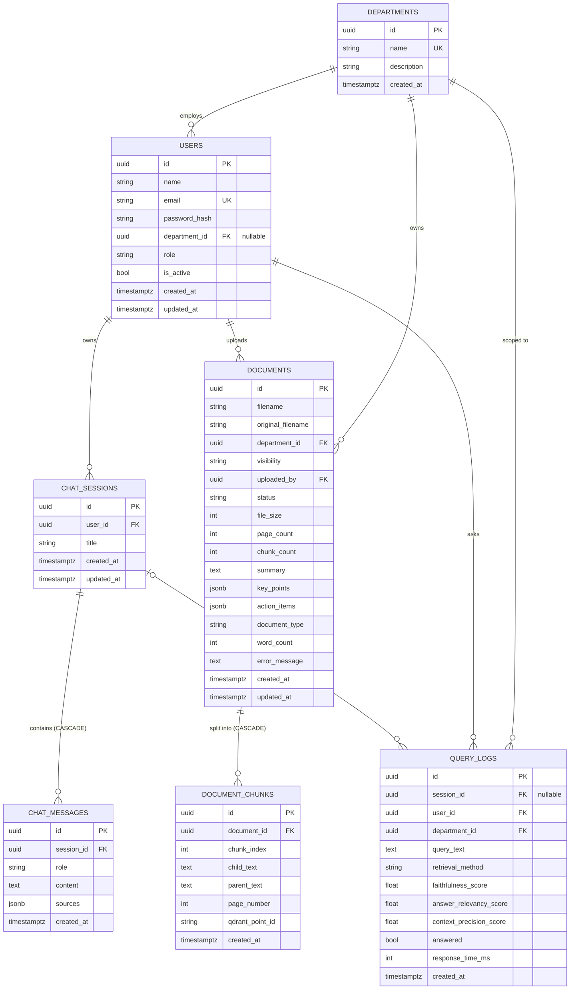

> **A note on the dual store.** The relational schema above is only *half* of where a
> document lives. The `document_chunks` table holds the canonical text and a pointer
> (`qdrant_point_id`) to the corresponding vector in Qdrant. The vector, its embeddings,
> and a denormalized copy of the chunk's access metadata live in the Qdrant collection
> (Section 2.7). The two stores are kept consistent by the ingestion pipeline writing
> both, and by reindexing reusing the stored `qdrant_point_id` so updates land in place.

### 2.3 The Ingestion Pipeline, End to End

When a user uploads a file, the HTTP handler (`routers/documents.py::upload_document`)
does only the fast, synchronous work — validate, persist a `processing` row, return
`202 Accepted` — and schedules the heavy lifting as a **background task**
(`services/ingestion_service.py::process_document`). The client then polls
`GET /documents/{id}/status` until the document becomes `ready`. This keeps the upload
request fast and the server responsive.

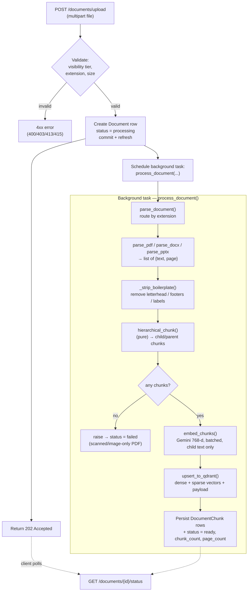

The orchestrator is wrapped in a `try/except` that, on **any** failure, marks the
document `failed` with a truncated error message and **swallows the exception** — a
background task must never crash the server. The failure is recorded in a *separate*
database session from the one doing the work, because that first session may already be
rolled back.

The pipeline is intentionally decomposed into small, single-responsibility functions —
`parse_*`, `parse_document`, `hierarchical_chunk`, `embed_chunks`, `build_sparse_vector`,
`upsert_to_qdrant`, `process_document` — with `hierarchical_chunk` deliberately **pure**
(no database, Gemini, or Qdrant calls) so the most correctness-critical logic can be
unit-tested in isolation.

### 2.4 Parsing & Boilerplate Stripping

**Format-specific parsers.** Each parser turns raw bytes into a list of
`{text, page}` dictionaries:

- **PDF** (`parse_pdf`, PyMuPDF/`fitz`): opens the file from an in-memory byte stream
  (the upload never touches disk), extracts text per page, cleans whitespace, and
  records a **1-based page number** — the number a human reads, and exactly what a
  citation ("page 3") must show. Pages with no extractable text (scanned, image-only
  pages) are silently skipped; OCR would be future work.
- **DOCX** (`parse_docx`, python-docx): extracts each non-empty paragraph. Word has no
  reliable page-number API (pagination is computed by the renderer, not stored), so
  `page` is `None` — citations from a DOCX show the filename only.
- **PPTX** (`parse_pptx`, python-pptx): extracts the title and body text of every
  text-bearing shape per slide, using the **1-based slide number** as the page.

**Whitespace cleaning** (`_clean_text`) collapses runs of spaces/tabs to one space,
trims trailing spaces per line, and collapses three-or-more newlines to a single
paragraph break — normalizing text while preserving paragraph structure.

**Boilerplate stripping** (`_strip_boilerplate`) is a quality optimization that matters
more than it first appears. A fixed letterhead, a classification banner ("CONFIDENTIAL"),
and a "Page X of Y" footer repeat on every page. If every chunk begins with the same
boilerplate, chunks from *different* documents start to look semantically similar — which
dilutes the embeddings and blunts the reranker's ability to tell relevant context apart.
Stripping it improves both retrieval precision and reranker discrimination. It runs in
two passes:

1. **Frequency pass.** Count how many pages each distinct line appears on; any line on
   **more than 60%** of pages is treated as structural boilerplate and removed. This
   pass requires at least 2 pages — on a single-page document every line trivially
   appears on "100%" of pages, so frequency cannot distinguish boilerplate there.
2. **Pattern pass** (`_is_pattern_boilerplate`, applied regardless of frequency).
   Removes lines that match the company name on a letterhead (`infovance`, anchored at
   line start), classification/distribution banners, bare page markers ("Page 3",
   "Page 3 of 12", "- 4 -"), footers ending in a page marker (whose trailing number
   varies per page, so the frequency pass alone can't catch them), and short (< 4-word)
   structural labels that are all-caps (a document code like `HR-POL-LV-2025-06`) or
   colon-terminated keys ("Owner:"). Sentence-case content like "12 days" is kept.

Pages that become empty after stripping are dropped entirely.

> **Why "INFOVANCE".** The benchmark corpus is a set of policy documents for a fictional
> company, *Infovance Technologies*. The boilerplate regex is tuned to that corpus's
> letterhead. In a production deployment this pattern would be configurable per tenant;
> here it is appropriately specialized to the evaluation corpus and flagged as such.

### 2.5 Hierarchical Chunking — The Math

Chunking is the heart of the ingestion side, and Pragya uses a **hierarchical**
(parent/child) scheme rather than flat fixed-size chunks. The motivation is a genuine
tension in RAG:

- **Small chunks retrieve precisely.** A 256-token chunk is tightly about one topic, so
  a vector match against it is sharp — the retrieved text is *exactly* on the query.
- **Large chunks generate well.** When the language model writes the answer, it needs
  enough surrounding context to be coherent and correct; 256 tokens is often too little.

Pragya resolves the tension by **retrieving on children but generating from parents**.
Each small *child* chunk is embedded and searched; but every child carries a pointer to
its larger *parent*, and it is the parent text that is handed to the LLM. You get the
precision of small-chunk retrieval *and* the context of large-chunk generation.

**The constants.** Token counts are approximated by word counts, because exact
tokenization is model-specific and not worth the dependency at this scale. The code uses
the standard rule of thumb that **one token ≈ 0.75 words** (so *N* tokens ≈ *N* / 0.75
words):

```text
1 token ≈ 0.75 words   ⟹   N tokens ≈ N / 0.75 words

CHILD_WORDS         = 341   ≈ 256  tokens   (256  / 0.75 ≈ 341)   — embedded + retrieved
PARENT_WORDS        = 1365  ≈ 1024 tokens   (1024 / 0.75 ≈ 1365)  — sent to the LLM
CHILD_OVERLAP_WORDS = 68    = 20% × 341                           — child-to-child overlap
child_step          = 341 − 68 = 273  words                       — advance per child
```

These are the literal constants in `ingestion_service.py` (`CHILD_WORDS = 341`,
`PARENT_WORDS = 1365`, `CHILD_OVERLAP_WORDS = 68`).

**Why the 20% child overlap.** A fact that straddles a child boundary — *"…must be
rotated every 90 / days…"* split across two chunks — would be cut in half and might
match neither chunk well. The 20% overlap (68 words) guarantees that any short fact
survives whole inside at least one child. **Parents do *not* overlap**: they are context
blocks, not match units, so overlapping them would only waste storage.

**The algorithm.** The document's pages are first flattened into a single word stream,
keeping a parallel array recording each word's source page (so a child can later report
the page it *starts* on — the basis of accurate citations). Then:

1. The stream is divided into **non-overlapping parents** of up to 1365 words
   (`parent_start` advances by `PARENT_WORDS` each iteration).
2. Within each parent, **overlapping children** of up to 341 words are carved out,
   stepping forward by `child_step = 273` words each time. A child stops being emitted
   once it reaches the parent's end (preventing a tiny trailing duplicate or an infinite
   loop).
3. Every child stores its own text, its parent's full text, its starting page number,
   and a global `chunk_index`.

A worked example for one full-size parent (1365 words) shows the overlap structure —
five children, each starting 273 words after the previous:

```text
Parent: words [0 .. 1365)        (1365 words ≈ 1024 tokens)
  child 0: words [0    .. 341)
  child 1: words [273  .. 614)     ← overlaps child 0 by 68 words
  child 2: words [546  .. 887)
  child 3: words [819  .. 1160)
  child 4: words [1092 .. 1365)    ← child_end == parent end → stop
⟹ one full parent yields 5 overlapping children.
```

**The short-document edge case.** If the *entire* document is shorter than a single
child (≤ 341 words), the code does **not** emit an empty or duplicate parent. Instead it
uses the full text as **both** the child and the parent (one chunk, `chunk_index = 0`,
page taken from the first word). This is an explicitly handled corner case from the
chunking specification — a one-paragraph memo still produces exactly one well-formed
chunk. If there are no extractable words at all (an all-image scanned PDF), the function
returns an empty list, and the orchestrator fails the document with a clear message
rather than marking an empty document `ready`.

> **Divergence callout — token approximation.** `CLAUDE.md` specifies child = 256 tokens
> and parent = 1024 tokens. The implementation approximates tokens with words at the
> 0.75 ratio (341 and 1365 words). This is a faithful, intentional approximation — the
> code comments state the conversion explicitly — but the chunks are sized in *words*,
> not exact model tokens, so a token-dense chunk may be slightly over the nominal token
> budget. The trade-off (no tokenizer dependency, fully deterministic, unit-testable)
> is the right one at this scale.

### 2.6 Embedding — Gemini & Matryoshka

Once a document is chunked, the **child** texts (and only the children — they are the
retrieval unit) are embedded by `embed_chunks()`:

- **Model & dimensions from config.** `gemini-embedding-001` at
  `output_dimensionality = 768`. Both come from settings; neither is hardcoded.
- **Matryoshka truncation 3072 → 768.** The model's native output is 3072-dimensional.
  Passing `output_dimensionality = 768` returns a 768-dimensional prefix that is itself
  a valid embedding, because the model is trained with *Matryoshka representation
  learning* (nested representations where any prefix is meaningful). This shrinks the
  Qdrant index ~4× and speeds similarity search at negligible quality cost. No
  re-normalization is needed after truncation because the collection uses **cosine**
  distance, which is scale-invariant.
- **Asymmetric task type.** Documents are embedded with `task_type =
  "retrieval_document"`. The query side (Section 3) uses `"retrieval_query"`. This
  asymmetry is essential: `gemini-embedding-001` places queries and documents into a
  shared space *only* when each side declares its correct role. Getting this wrong
  degrades retrieval silently, with no error — one of the most common invisible RAG
  bugs — so the two task-type constants are deliberately kept in separate modules and
  never shared.
- **Batching for the free tier.** Texts are embedded in batches of
  `EMBEDDING_BATCH_SIZE = 20`, with a one-second pause *between* batches (not after the
  last) to stay under Gemini's free-tier requests-per-minute limit. The blocking Gemini
  SDK call is run via `asyncio.to_thread` so it does not stall the event loop while the
  background task waits.

### 2.7 The Qdrant Collection

All vectors live in one Qdrant collection, `pragya_docs` (name from
`QDRANT_COLLECTION`), created once at startup by `qdrant.py::create_collection()`
(idempotent — a second startup detects the existing collection and returns quietly).

**Named vectors — the hybrid foundation.** The collection is configured with *two*
named vectors per point:

```text
vectors_config        = { "dense":  VectorParams(size=768, distance=COSINE, on_disk=False) }
sparse_vectors_config = { "sparse": SparseVectorParams(index=SparseIndexParams(on_disk=False)) }
```

A search names which vector it wants via Qdrant's `using="dense"` / `using="sparse"`
argument. Both vectors are kept in RAM (`on_disk=False`) for retrieval speed. Two things
must be exactly right or hybrid search silently breaks: the dense entry must be a
*named* vector (a dict keyed `"dense"`, not a bare `VectorParams`), and the sparse config
must be a *separate* argument, not merged into `vectors_config`.

**Payload — every point carries its own access metadata.** Each point's payload holds:

| Payload field | Source | Used for |
|---------------|--------|----------|
| `document_id` | document UUID (str) | Document-scoped retrieval; grouping in search. |
| `department_id` | department UUID (str) | RBAC: department-tier match. |
| `visibility` | `company`/`department`/`personal` | RBAC: which tier. |
| `uploaded_by` | uploader UUID (str) | RBAC: personal-tier match. |
| `chunk_index` | int | Ordering / debugging. |
| `parent_text` | the ~1024-token parent | The text handed to the LLM at generation. |
| `source_filename` | sanitized filename | Citation display. |
| `page_number` | int or null | Citation display. |

Two design points are worth highlighting. First, the **parent text is stored in the
payload**, so generation needs no second database round-trip — the retrieved point
already carries the context block. (The smaller `child_text` is *not* stored in the
payload; it lives only in PostgreSQL.) Second, the access metadata (`department_id`,
`visibility`, `uploaded_by`) is **denormalized into every point**, so the access filter
can be applied entirely inside the Qdrant query with no database lookup.

**Indexed payload fields.** To make the access filter an O(1) lookup rather than an
O(*n*) scan of every point, three payload fields are given a keyword index at collection
creation: `department_id`, `visibility`, and `uploaded_by` — precisely the fields the
visibility filter matches on (Section 4.4).

**UUIDs are stored as strings.** Both at ingestion (payload writes `str(department_id)`,
`str(uploaded_by)`, etc.) and at query time (the filter uses `str(...)`). Qdrant's
`MatchValue` compares by *exact type*; a raw `uuid.UUID` would match zero points with no
error — a subtle trap the code calls out and avoids.

### 2.8 The Sparse Channel & Its Honest Limitations

Pragya implements a sparse (keyword) vector alongside the dense one, intended as a
BM25-style signal that catches exact tokens dense retrieval misses — abbreviations like
"CL" (casual leave) that have no useful embedding neighborhood. This section documents
how it is built **and** a real defect the evaluation exposed. Reporting it is the point:
a technical report that hides a known limitation is worth less than one that finds it.

**How the sparse vector is built.** The ingestion side (`build_sparse_vector`) and the
query side (`sparse_retrieve`) each turn text into a sparse vector by hashing words into
an index space and using term frequency as the value:

```text
INGESTION (build_sparse_vector, ingestion_service.py):
    tokens  = lowercase, strip non-alphanumeric, split
    index   = abs(hash(word)) % 100_000          ← index space = 100,000
    value   = count(word) / total_tokens          ← normalized term frequency

QUERY (sparse_retrieve, retrieval_service.py):
    index   = abs(hash(word)) % 30_000            ← index space =  30,000  (SPARSE_INDEX_SPACE)
    value   = raw count(word)                      ← unnormalized term frequency
```

A sparse dot-product in Qdrant only contributes a non-zero score when a query index and
a stored index **coincide**. For that to happen for a given word, the ingestion-time and
query-time index for that word must be equal. They are not, for **two independent
reasons**:

1. **Index-space mismatch (100,000 vs 30,000).** Ingestion reduces modulo 100,000;
   query reduces modulo 30,000. `abs(hash(w)) % 100000` and `abs(hash(w)) % 30000` are
   equal only by coincidence, so even identical hash values would usually land on
   different indices.

2. **Per-process hash salting (the deeper problem).** Python's built-in `hash()` for
   strings is **randomized per process** via `PYTHONHASHSEED` (a security default).
   Ingestion runs in one process and querying in another, so `hash("leave")` differs
   between them — meaning that *even if the moduli matched*, the same word would hash to
   different indices at ingestion and query time. The sparse indices therefore do not
   align across the two stages at all.

**The consequence, stated plainly.** The sparse channel contributes essentially **no
real keyword matches** in the current build. Dense retrieval carries the system. This is
exactly consistent with the evaluation result in Section 7, where the *hybrid*
configuration scores almost identically to *dense* (average 0.907 vs 0.905) — if sparse
were contributing meaningful signal, hybrid would separate further from dense. The fusion
machinery (RRF) is correct and fully wired; it is simply fusing a strong dense list with
a near-empty/noise sparse list.

**The honest fix.** Two changes would revive the channel: (a) unify the index space to a
single shared constant, and (b) replace Python's salted `hash()` with a **stable** hash
(e.g. `hashlib.md5`/`blake2` of the word, or — better — a real learned sparse encoder
such as SPLADE or FastEmbed's BM25, which the code comments already name as the
production path). Either makes ingestion and query indices deterministic and aligned.
This is recorded as known future work in Section 8.

> **Why keep it in the report rather than quietly fix it.** The system as evaluated had
> this defect, and the evaluation numbers in Section 7 reflect it. Silently patching the
> code and re-using the old numbers would make the report describe a system that was
> never measured. The defect is documented, its effect on the results is quantified, and
> the fix is specified — which is the correct engineering treatment of a finding.

---

## 3. Retrieval Pipeline — The Research Core

This is the heart of Pragya and the subject of its research contribution. Everything in
`services/retrieval_service.py` exists to answer one question well: *given a user's
question and their access rights, which passages from the corpus should the language
model read before answering?* The module implements three increasingly elaborate
retrieval pipelines behind a single public entry point, `retrieve(query, current_user,
method, document_id)`, so the rest of the application — and the evaluation harness —
switches between them with one string argument and never sees the internals.

Two invariants run through every function in this module:

- **Asymmetric embedding.** The query is embedded with `task_type="retrieval_query"`,
  while documents were embedded at ingestion with `"retrieval_document"` (Section 2.6).
  Mixing the two silently degrades retrieval with no error — a classic invisible RAG
  bug — so the two task-type constants live in separate modules and are never shared.
- **Access control on every search.** Every Qdrant query is wrapped in the 3-tier
  visibility filter (Section 4.4), built once per call from the caller's department and
  user id and shared identically by the dense and sparse branches. There is no retrieval
  path that is not access-filtered.

### 3.1 The Full Query Pipeline

The diagram below traces a single question through the *full* pipeline
(`method = "hybrid_rerank"`, which is what chat uses). The simpler methods are this
pipeline with later stages removed (Section 3.6).

```mermaid
flowchart TD
    Q["User question<br/>+ authenticated User"] --> F["Build 3-tier visibility filter<br/>(company / department / personal)"]
    F --> DOC{"document_id<br/>scoped?"}
    DOC -- yes --> F2["AND filter with<br/>payload.document_id"]
    DOC -- no --> EMB
    F2 --> EMB["embed_query()<br/>Gemini 768-d, task=retrieval_query<br/>(run off the event loop)"]

    EMB --> DR["dense_retrieve()<br/>using='dense', cosine<br/>top_k = 20, RBAC-filtered"]
    EMB --> SR["sparse_retrieve()<br/>using='sparse', BM25-style<br/>top_k = 20, RBAC-filtered"]

    DR --> RRF["rrf_fusion(k = 60)<br/>sum 1/(k+rank), dedup by id<br/>cap pool at 40"]
    SR --> RRF
    RRF --> RR["rerank()<br/>cross-encoder on (query, parent_text)<br/>keep top_n = 5"]
    RR --> OUT["Top-5 parent chunks → generation<br/>(Section 4)"]

    F -. "shared by both<br/>retrievers" .- DR
    F -. .- SR
```

The orchestrator also records, for every call, the method, the number of results, and
the elapsed milliseconds — the timing that feeds the latency column of the research
comparison and the `response_time_ms` of each query log.

### 3.2 Dense Retrieval — Cosine Similarity

Dense retrieval (`dense_retrieve`) is the semantic baseline (Experiment A) and the
backbone of all three methods. The query vector is compared against every accessible
document's `dense` vector by **cosine similarity**, and the top 20 are returned.

Cosine similarity measures the *angle* between two vectors, ignoring their magnitude —
which is why no re-normalization was needed after the Matryoshka truncation (Section
2.6):

```math
\text{cosine}(\mathbf{q}, \mathbf{d}) \;=\; \frac{\mathbf{q} \cdot \mathbf{d}}{\lVert \mathbf{q} \rVert \, \lVert \mathbf{d} \rVert} \;=\; \frac{\sum_{i=1}^{768} q_i d_i}{\sqrt{\sum_{i=1}^{768} q_i^2}\;\sqrt{\sum_{i=1}^{768} d_i^2}}
```

The result lies in $[-1, 1]$; higher means more semantically similar. Qdrant computes
this internally (the collection's `dense` vector is configured with
`Distance.COSINE`) and returns it as each point's `score`. The call passes
`using="dense"` to select the named vector, the prebuilt visibility filter as
`query_filter`, and `limit=20`.

**Why top 20 and not top 5.** Twenty is deliberately generous. Dense and sparse each
contribute 20 candidates so that the downstream RRF fusion has a real pool to work with
rather than a thin list — and so the cross-encoder, which is the actual precision stage,
has enough candidates to choose from. Retrieval here favors *recall*; precision is
recovered later by fusion and reranking.

Dense retrieval is also used directly, on its own, by the **document search** feature
(`GET /documents/search`), which embeds the query, runs a single dense search with the
same visibility filter (with a wider `limit=30`), and caps the results to two chunks per
document.

### 3.3 Sparse Retrieval — BM25-Style Keyword Matching

Sparse retrieval (`sparse_retrieve`) exists to catch what dense retrieval is blind to:
**exact keyword matches**. Semantic embeddings have no useful neighborhood for an
abbreviation like "CL" (casual leave) or "EL" (earned leave) — there is nothing to be
"near" — but a keyword match finds the literal token instantly. This is the
complementary signal hybrid retrieval is meant to add.

The query is turned into a sparse vector by hashing each lowercased word to an index and
using term frequency as the value, then Qdrant scores it against stored sparse vectors by
a **sparse dot product** over shared indices:

```math
\text{score}_{\text{sparse}}(\mathbf{q}, \mathbf{d}) \;=\; \sum_{i \,\in\, \text{idx}(\mathbf{q})\,\cap\,\text{idx}(\mathbf{d})} q_i \cdot d_i
```

where $\text{idx}(\cdot)$ is the set of non-zero indices of a sparse vector and $q_i$,
$d_i$ are the term-frequency values at a shared index $i$. Only indices present in *both*
the query and a document contribute — which is exactly keyword overlap.

The implementation builds `{index: term_frequency}` by accumulating into a dict first
(so a repeated word or a hash collision merges into one entry rather than producing a
duplicate index, which Qdrant rejects), then issues the search with `using="sparse"`,
the shared visibility filter, and `limit=20`.

> **Honesty pointer.** As established in Section 2.8, the sparse channel is built but
> effectively non-functional in the current build, because the ingestion-time and
> query-time hash indices do not align (index-space mismatch 100,000 vs 30,000, *and*
> Python's per-process `hash()` salting). The mathematics above is correct and the code
> path runs; it simply finds few real index intersections, so the sparse list contributes
> little signal. The effect on the measured results is quantified in Section 7. The fix
> (a stable hash or a learned sparse encoder) is recorded in Section 8.

### 3.4 RRF Fusion — Formula & Worked Example

Dense and sparse produce two ranked lists whose *scores are not comparable* — a cosine
similarity around 0.7 and a sparse dot product of, say, 3.0 live on different scales.
**Reciprocal Rank Fusion (RRF)** sidesteps this entirely by ignoring the raw scores and
using only **rank**. Each list contributes, for each document it ranks, a term that
depends only on that document's position; a document's final score is the **sum** of its
contributions across the lists:

```math
\text{RRF}(d) \;=\; \sum_{L \,\in\, \{\text{dense},\, \text{sparse}\}} \; \frac{1}{k + \text{rank}_L(d)}, \qquad k = 60
```

Here $\text{rank}_L(d)$ is the **1-based** position of document $d$ in list $L$ (the top
result is rank 1), and a document absent from a list contributes nothing from that list.
The constant is `k = 60` in the code (`rrf_fusion(..., k: int = 60)`).

**Why `k = 60`.** The constant *dampens* the influence of the very top ranks. With
`k = 60`, the gap between rank 1 ($\tfrac{1}{61} \approx 0.01639$) and rank 2
($\tfrac{1}{62} \approx 0.01613$) is tiny, so no single list can dominate purely because
one of its items happened to land first. 60 is the standard default from the original
RRF paper (Cormack et al., 2009). Beyond this one constant, **RRF is parameter-free** —
there are no per-method weights to tune, which is a large part of its appeal: it fuses
two heterogeneous retrievers with no training and no calibration.

**The key insight.** Because contributions *sum*, a document that ranks respectably in
**both** lists beats a document that ranks #1 in only one. Agreement between two
independent retrieval systems is a strong relevance signal, and that is precisely what
RRF rewards.

**Worked numerical example.** Suppose for a query the two retrievers return these ranked
lists (showing five distinct chunks A–E):

| Rank | Dense list | Sparse list |
|:----:|:----------:|:-----------:|
| 1 | A | C |
| 2 | B | A |
| 3 | C | E |
| 4 | D | B |

Applying $\text{RRF}(d) = \sum \tfrac{1}{60 + \text{rank}}$:

| Chunk | Dense contribution | Sparse contribution | RRF score | Final rank |
|:-----:|:------------------:|:-------------------:|:---------:|:----------:|
| **A** | rank 1 → 1/61 = 0.01639 | rank 2 → 1/62 = 0.01613 | **0.03252** | **1** |
| **C** | rank 3 → 1/63 = 0.01587 | rank 1 → 1/61 = 0.01639 | **0.03227** | **2** |
| **B** | rank 2 → 1/62 = 0.01613 | rank 4 → 1/64 = 0.01563 | **0.03175** | **3** |
| **E** | — (absent) | rank 3 → 1/63 = 0.01587 | 0.01587 | 4 |
| **D** | rank 4 → 1/64 = 0.01563 | — (absent) | 0.01563 | 5 |

Read the result. **A** and **C** both appear high in *both* lists, so their summed
contributions lift them to the top — even though **C** was only third in the dense list,
its first place in sparse pushes it above **B**, which was second in dense but languished
in sparse. **D** and **E**, each strong in only one list, sink to the bottom. The fusion
has rewarded cross-method agreement exactly as intended, with no tunable weights.

The implementation accumulates these summed scores in a dict keyed by `qdrant_id` (so
**deduplication is automatic** — a chunk retrieved by both methods appears once with its
combined score), sorts descending, and **caps the pool at 40** candidates — enough for
the reranker to choose from without paying to cross-encode an unbounded list.

### 3.5 Cross-Encoder Reranking

The final stage of the full pipeline (Experiment C) re-scores the fused candidates with
a **cross-encoder** and keeps the best five. Understanding why this can help requires the
bi-encoder vs. cross-encoder distinction.

**Bi-encoder (what dense and sparse are).** The query and each document are encoded
**independently** into vectors, then compared by a cheap distance:

```math
\text{sim}_{\text{bi}}(q, d) \;=\; \text{cosine}\big(\text{Enc}(q),\; \text{Enc}(d)\big)
```

The encoder never sees the query and document *together*. This is fast — every document
can be embedded once, offline — but it throws away token-level interaction.

**Cross-encoder (the reranker).** The query and document are concatenated and fed through
the transformer **as one input**, so self-attention can relate every query token to every
document token:

```math
\text{score}_{\text{cross}}(q, d) \;=\; \text{Transformer}\big(\,\texttt{[CLS]}\; q \;\texttt{[SEP]}\; d \;\texttt{[SEP]}\,\big) \;\rightarrow\; \mathbb{R}
```

The output is a single relevance score per pair. This joint view is substantially more
accurate than independent embedding — but far more expensive, because nothing can be
precomputed: every (query, document) pair is a full forward pass. That cost is exactly
why the reranker runs only on the ~40 fused candidates, never the whole corpus.

**The model.** Pragya uses `cross-encoder/ms-marco-MiniLM-L-6-v2` (sentence-transformers),
a 6-layer MiniLM cross-encoder trained on the MS MARCO passage-ranking dataset. It is
~85 MB, runs locally on CPU, and is loaded **once** into a module-level singleton
(`get_reranker()`) — the first call downloads and loads the weights (slow), every call
after is instant. Constructing a cross-encoder per request would make load cost dominate
every query.

**Reranking on parent text, then keeping five.** The reranker scores
`(query, parent_text)` pairs — **not** `child_text`. This is deliberate: `parent_text` is
what the language model will actually read when generating the answer, so relevance must
be judged against the parent, not the shorter child that was used only as the retrieval
key. The candidates are sorted by the cross-encoder score (a NumPy float, cast to a plain
`float` so it serializes to JSON), and the **top 5** are returned for generation.

> **Empirical caveat — reranking is not free lunch.** Intuitively, adding a cross-encoder
> should only help. On Pragya's corpus it does **not**: the evaluation (Section 7) shows
> `hybrid_rerank` scoring *lowest* of the three methods, with faithfulness dropping from
> ~0.87–0.89 to 0.75. The likely mechanism is **over-pruning** — by aggressively cutting
> to a top-5 of parents, the reranker sometimes drops a context block the answer needed,
> and an answer with a missing source scores worse on faithfulness. This is one of the
> report's most useful findings and is treated fully in Section 7.5.

### 3.6 The Three Methods as Configurations

All three experiments are the *same* pipeline truncated at different stages. The single
`retrieve()` entry point switches on the `method` string and runs exactly the stages that
method requires:

| Stage | `dense` (A) | `hybrid` (B) | `hybrid_rerank` (C) |
|-------|:-----------:|:------------:|:-------------------:|
| Embed query (asymmetric) | ✓ | ✓ | ✓ |
| Dense retrieve (top 20, cosine) | ✓ | ✓ | ✓ |
| Sparse retrieve (top 20, BM25-style) | — | ✓ | ✓ |
| RRF fusion (`k=60`, cap 40) | — | ✓ | ✓ |
| Cross-encoder rerank (top 5) | — | — | ✓ |
| **Typical output cardinality** | up to 20 | up to 40 | **exactly 5** |
| **Relative cost** | 1 embed + 1 search | 1 embed + 2 searches | + ~40 cross-encoder passes |

**Where each is used in the running system:**

- **`hybrid_rerank`** is the chat default (`routers/chat.py`, `CHAT_RETRIEVAL_METHOD =
  "hybrid_rerank"`) — chat always runs the full stack.
- **`dense`** powers the document-search feature directly (one dense search, no fusion or
  rerank).
- All three are exercised side-by-side by the **evaluation harness**, which is the only
  place the methods are compared head-to-head (Section 7).

> **The K-asymmetry caveat (foreshadowing Section 7).** Notice the three methods return
> *different numbers* of contexts — dense yields up to 20 (≈8 after parent-dedup),
> hybrid up to 40 (≈12 deduped), and rerank exactly 5. A fair metric comparison cannot
> simply score "all returned contexts," because that would compare precision over
> different list lengths. The evaluation addresses this by scoring a fixed **top-3** of
> contexts per question for context precision, turning the comparison into a clean
> precision@3 across all three methods. This asymmetry, and how the harness controls for
> it, is documented honestly in Section 7.

---

## 4. Generation, Citations & Access Control

Retrieval (Section 3) found the relevant parent chunks; this section covers what happens
next — turning those chunks into a grounded, cited answer that streams to the user, and
the access-control system that decided which chunks the user was allowed to see in the
first place. Generation logic lives in `services/generation_service.py`; access control
is split between the Qdrant-layer visibility filter (`qdrant.py`) and the application-layer
document checks (`routers/documents.py`), with authentication in `middleware/rbac.py` and
`services/auth_service.py`.

### 4.1 Citation-Enforced Generation

The single most important design decision on the generation side is that the model is
**forbidden from using any knowledge outside the retrieved context**. This is what makes
citations meaningful and faithfulness measurable: an answer can only cite a block the
system actually retrieved.

**The prompt structure.** `build_citation_prompt()` assembles the prompt in four parts,
in this order: system rules → optional recent conversation → numbered context blocks →
the question. The system instructions are the load-bearing contract (reproduced verbatim
from the code):

```text
You are Pragya, a precise knowledge assistant.
Answer ONLY using the provided context blocks.
Cite every factual claim using [Source: N] where N is the context block number.
If the answer is not in the context respond with exactly: I don't have information on
  this in your department's documents.
Do not infer, extrapolate, or use outside knowledge.
```

Three of these five lines exist purely to suppress hallucination: *"Answer ONLY using the
provided context blocks,"* *"Do not infer, extrapolate, or use outside knowledge,"* and
the fixed-refusal instruction. Together they convert the open-ended generation task into a
**closed-book-over-provided-context** task — the model's job is reduced to *reading and
attributing*, not *recalling*.

**The numbered-block mechanism.** After the system rules and any conversation history, the
retrieved chunks are emitted as numbered context blocks. Each block is a **1-based**
number, a `Source:` line (filename, plus page if the source has one), and the block's
**parent text**:

```text
Context blocks:
[1] Source: HR_Leave_Policy_2025.pdf, Page 4
<the full parent_text of the top chunk>

[2] Source: IT_Security_Policy_2025.pdf, Page 2
<the full parent_text of the next chunk>
...

Question: How many casual leaves do I get?

Answer:
```

The block numbers are **load-bearing**: the model is told to cite `[Source: N]`, and after
generation `extract_sources()` maps each `N` back to the *N*-th block to recover the real
filename and page. The numbering in the prompt and the indexing in `extract_sources()`
must therefore stay in lockstep — both are 1-based, and both deduplicate parents
identically (Section 4.2). A page of `None` (a DOCX source) is rendered as
`Source: <filename>` with no "Page" suffix, never the literal string "None".

**Citation recovery.** `extract_sources(response_text, chunks)` runs *after* streaming
completes, on the full accumulated answer. It finds every `[Source: N]` with the regex
`\[Source:\s*(\d+)\]` (tolerating `[Source:3]` without a space), looks up `chunks[N-1]`,
and pulls the real filename and page from that chunk's payload. The result is
**deduplicated by `(filename, page)`** — if the model cites two different blocks from the
same page of the same file, the user sees that source once — and a citation number outside
the valid range (a hallucinated `N`) is silently skipped rather than crashing. Each
recovered source is a dict `{filename, page, citation_number}`, whose keys match the
`MessageSource` schema so it deserializes straight back on read. This list is what gets
persisted in `chat_messages.sources` and rendered as the citation chips beneath an answer.

**The fixed refusal as a three-way contract.** The exact string `NO_INFO_RESPONSE`
(*"I don't have information on this in your department's documents."*) is defined **once**
and reused in three places that must never drift apart: (1) the system prompt instructs the
model to emit it verbatim when the answer isn't in context, (2) the chat router streams it
directly when retrieval returns *no* chunks at all, and (3) `response_indicates_no_info()`
matches against it (case-insensitive substring) to set `query_logs.answered = False`. A
one-character drift would silently mislabel analytics and break exact-match behavior — so
centralizing it is a correctness measure, not just tidiness.

### 4.2 Parent Deduplication Before Generation

Hierarchical retrieval has a built-in redundancy: several overlapping *child* chunks
frequently map to the **same parent**, so the retrieved top-*k* can contain several
near-identical parent blocks. Sending them all to the model wastes tokens and induces
**over-citation** — the model writes `[Source: 1, 2, 3, 4, 5]` for a single fact because
five blocks all support it.

`_dedupe_by_parent()` removes this. It keys each chunk on the **first 200 characters** of
its `parent_text` — a reliable, cheap proxy for a near-duplicate parent without a full
string compare — and keeps the first occurrence, preserving order so block numbering stays
stable. The function is used by **both** `build_citation_prompt()` (to number the blocks
the model sees) and `extract_sources()` (to resolve `[Source: N]` back to a block). They
**must** deduplicate identically, or the citation numbers the model used would not line up
with the sources recovered afterward — so the same function is deliberately shared by both.

### 4.3 SSE Streaming & Turn Persistence

**Why streaming.** A grounded answer over five parent blocks can take a few seconds to
generate. Streaming tokens as they arrive — rather than blocking on a spinner — is what
makes the product feel alive. Pragya streams over **Server-Sent Events (SSE)**.

`generate_stream()` calls Gemini with `stream=True` (the SDK's native async path,
`generate_content_async`), and for each partial response yields one SSE frame
`data: <token>\n\n`. Two sentinels frame the stream for the client:

- `data: [DONE]\n\n` — generation finished cleanly; the client stops listening and the
  source citations are parsed.
- `data: [ERROR] <message>\n\n` — generation failed mid-stream (for example a free-tier
  `429 RESOURCE_EXHAUSTED`). Because a `StreamingResponse` has *already* sent its `200 OK`
  headers by the time the body streams, the status code can no longer be changed — so the
  error is signaled **in-band** and the generator stops.

A small guard, `_safe_chunk_text()`, protects the loop: accessing `chunk.text` *raises* if
a chunk carries no text part (e.g. a chunk that only carries a finish reason or a safety
block), so one part-less chunk is coerced to `""` instead of blowing up the whole stream.

**The streaming + persistence ordering** (in `routers/chat.py`) is the subtle part, because
a `StreamingResponse` sends its headers the instant it is returned and then streams the
body from an async generator:

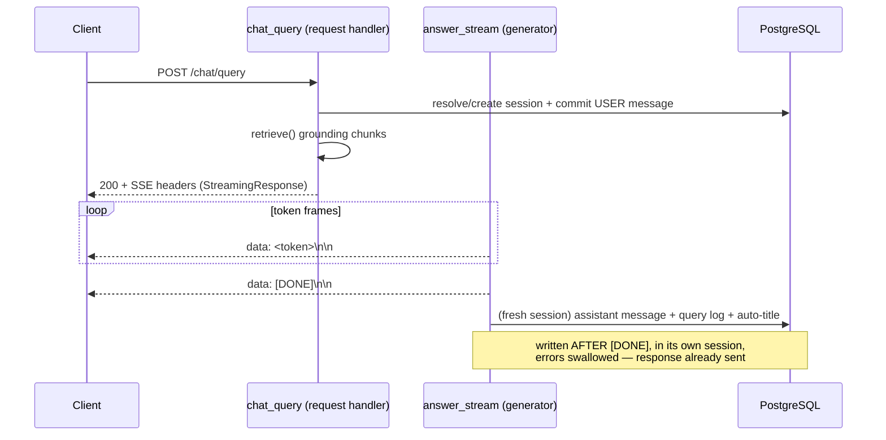

The **user message** and session row are committed *before* the response is returned — they
must exist regardless of how streaming goes. The **assistant message, the query log, and
the auto-generated session title** are written *inside* the generator, *after* `[DONE]`, at
the point where the full answer text is known. They use a **fresh** database session
(`get_session()`), not the request-scoped one, because the request session's lifecycle and
the streaming generator's lifecycle interleave. The persistence helper swallows its own
errors — a failure to log must never become an unhandled exception mid-stream, since the
response is already on the wire.

Two correctness details flow from this design. On the **no-chunks** path (empty department
or no matches) the router streams `NO_INFO_RESPONSE` directly and logs the turn with
`answered=False`. On the **error** path (generation threw, or produced no text) it logs the
query as `answered=False` but **does not** persist a blank assistant message — an empty
bubble would render as a broken answer, and `query_logs.answered` feeds the research table,
so it must be correct.

The auto-title for a new conversation is a *second* Gemini call (`generate_session_title()`,
"generate a 4-word title…"), made best-effort: it is the most likely call to hit the
free-tier rate limit, so a failure falls back to the first few words of the question
(`_fallback_title()`) and never costs the user the answer they already received.

### 4.4 The 3-Tier Visibility Model

Access control is enforced in two complementary places: the **vector-DB query layer** (for
retrieval — chat and semantic search) and the **application layer** (for listing, status,
intelligence, and reindex). The model has three visibility tiers, stored on
`documents.visibility` and denormalized into every Qdrant point's payload:

| Tier | Who can access | Who can create it |
|------|----------------|-------------------|
| **`company`** | **All** authenticated users, any department | Admins only |
| **`department`** | Users whose `department_id` matches the document's (the original single-level behavior; the default) | Any user (for their own department) |
| **`personal`** | **Only** the uploader (`uploaded_by == user.id`) — not admins, not HR; a hard privacy guarantee | Any user |

**Enforcement at the Qdrant layer — `build_visibility_filter()`.** This is *the* RBAC
boundary for retrieval. It expresses "a chunk is retrievable if **any** of the three tiers
grants access" as a Qdrant `should` (logical OR) of three nested `must` (logical AND)
sub-filters:

```math
\text{retrievable}(c) \;=\; \underbrace{(\,v_c = \texttt{company}\,)}_{\text{tier 1}} \;\lor\; \underbrace{(\,v_c = \texttt{department} \,\land\, \text{dept}_c = \text{dept}_u\,)}_{\text{tier 2}} \;\lor\; \underbrace{(\,v_c = \texttt{personal} \,\land\, \text{owner}_c = u\,)}_{\text{tier 3}}
```

where $v_c$ is the chunk's visibility, $\text{dept}_c$/$\text{dept}_u$ the chunk's and
user's departments, and $\text{owner}_c$/$u$ the chunk's uploader and the current user.
Because this filter is part of *every* retrieval query, a forbidden chunk is **never a
candidate** — there is no code path that scores a forbidden document and then hides it. The
decision logic, per chunk:

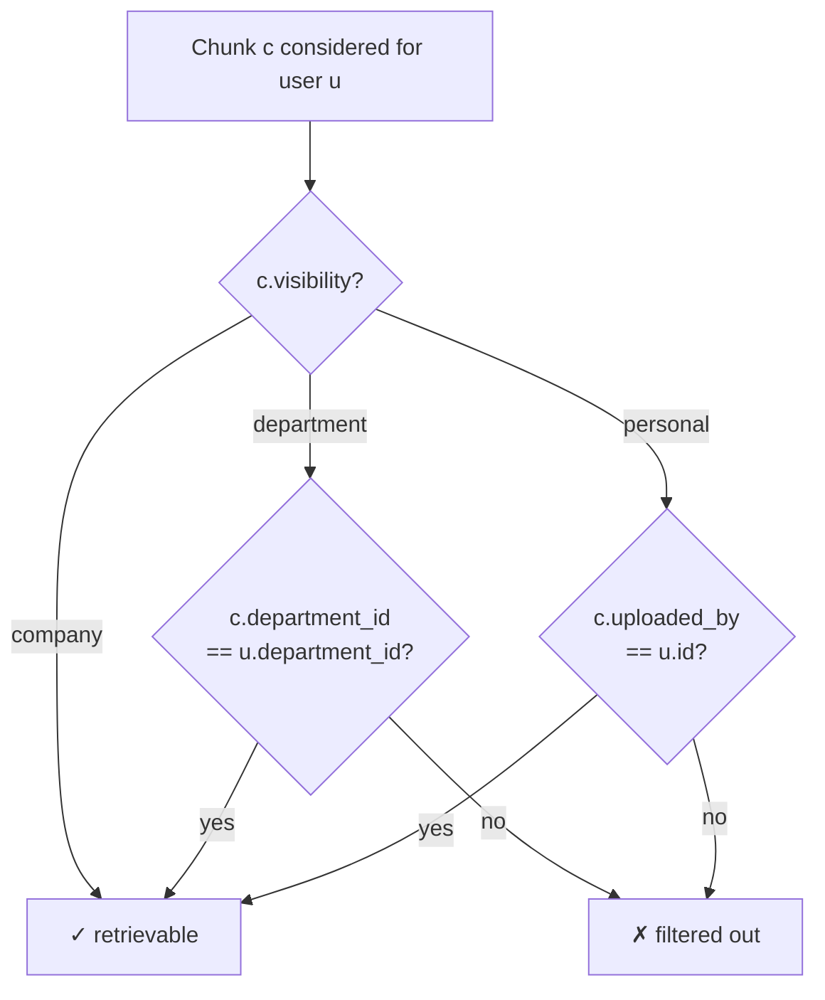

Two implementation details guard correctness. The department and user ids are **stringified**
for the filter (`str(...)`), because Qdrant stored them as strings and `MatchValue` compares
by exact type — a raw `uuid.UUID` would match zero points with no error. And the retrieval
filter deliberately has **no admin branch**: for *retrieval*, an admin is scoped to their own
department exactly like anyone else (the literal 3-tier spec). When a query is scoped to a
single document, this visibility filter is wrapped in an outer `must` alongside the
`document_id` match (AND), so scoping can only ever *narrow* access — a user cannot reach a
document they lack access to by passing its id.

**Enforcement at the application layer — `can_access_document()`.** Listing a document,
polling its status, generating its intelligence, or reindexing it goes through a single
predicate, `can_access_document(document, user)`, the source of truth for *per-document*
access:

- `company` → everyone;
- `personal` → only the uploader (not even an admin);
- `department` → an **admin** may access **any** department's department-docs; everyone else
  only their own department's.

This is where the **admin asymmetry** lives, and it is intentional. An admin's broader reach
over department documents is a *listing/management* concern, not a *retrieval* one — so it
appears in `can_access_document()` but **not** in the Qdrant retrieval filter. The
`GET /documents` list endpoint pushes this exact predicate into its SQL `WHERE` clause (three
OR-branches mirroring the three tiers, with the admin branch added for `department`), so it
never loads documents it would then discard. Creating a `company` document is admin-gated at
upload time (`visibility == "company"` requires `role == "admin"`, else `403`).

### 4.5 JWT Authentication & the RBAC Dependency Chain

Authentication is stateless JSON Web Tokens; there are no server-side sessions. The crypto
lives in `services/auth_service.py` (pure functions, no DB), and the request-time
enforcement in `middleware/rbac.py` (FastAPI dependencies).

**Password handling.** Passwords are hashed with **bcrypt** via passlib's `CryptContext`.
bcrypt generates a random salt and stores it *inside* the hash string, so no salt is tracked
separately, and two hashes of the same password differ (which is correct). Verification is
constant-time (timing-safe), and returns `False` rather than raising on mismatch so callers
branch normally.

**Token structure.** `create_access_token()` mints a JWT carrying just enough identity to
authorize most requests without a database hit:

```text
{
  "sub":           "<user_id>",                  # standard subject claim (UUID as string)
  "department_id": "<department_id>" | null,      # the RBAC boundary; real null if absent
  "role":          "admin" | "user" | "viewer",
  "exp":           <now + 8 hours>,               # UTC-aware
  "iat":           <now>                          # issued-at (audit/debug)
}
```

signed `HS256` with `SECRET_KEY`, expiring after `ACCESS_TOKEN_EXPIRE_HOURS = 8`. Two
correctness notes from the code: the UUIDs are stringified because `jwt.encode` runs
`json.dumps` internally, which cannot serialize a `UUID`; and a *null* `department_id` is
emitted as a real JSON `null`, never the literal string `"None"` — which would silently
poison the RBAC filter.

**The dependency chain.** Authorization is layered as a chain of FastAPI dependencies, so
each protected route declares only the level of access it needs and the framework runs the
checks *before* the handler:

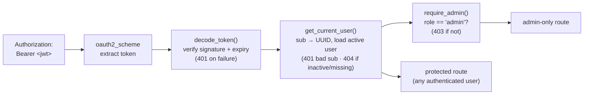

- **`get_current_user`** decodes the token, turns `sub` back into a `UUID`, and loads the
  user with `is_active == True` folded **into the same query**. Putting the active-account
  check here (not in each router) means a deactivated user loses access on their very next
  request everywhere, and a deactivated account is indistinguishable from a deleted one to
  the caller — we don't leak that the account still exists. A valid token whose subject no
  longer resolves to an active user yields `404`.
- **`require_admin`** is layered on top: authentication runs first, then this authorization
  check. A logged-in non-admin gets `403` (authenticated but forbidden), distinct from the
  `401` an anonymous caller gets. It gates department/role management, company-wide uploads,
  and the entire analytics dashboard.

**Login does not leak which emails exist.** The login handler returns an identical `401`
whether the email is unknown *or* the password is wrong. Distinct messages would let an
attacker enumerate registered emails; the uniform response prevents it.

---

## 5. Feature Modules

Sections 2–4 covered the two core flows (ingestion and query) and the cross-cutting
access-control system. This section walks through every *feature* module built on top of
that foundation, one subsection each: what it is for, how it works, the endpoints it
exposes, and the data flow. Each is grounded in the real router and service code.

### 5.1 Auth & Onboarding

**Purpose.** Get a new employee from "no account" to "querying their department's
documents" in as few steps as possible, while bootstrapping an empty organization
without a chicken-and-egg deadlock.

**How it works.** Onboarding is a two-step flow: create an account, then join a
department. The split exists because a department assignment is the RBAC boundary
(Section 4.4), and a brand-new organization has no departments or admins yet.

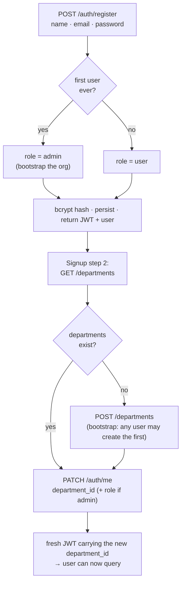

**Endpoints (`routers/auth.py`, `routers/departments.py`):**

| Method & path | Purpose | Notable behavior |
|---|---|---|
| `POST /auth/register` | Create account | Email-uniqueness pre-check → clean `409` (not a raw DB error). The **first user ever** is auto-promoted to `admin` (counted *before* insert). Returns a JWT immediately, so registration doubles as login. `201`. |
| `POST /auth/login` | Email + password → JWT | Uniform `401` whether email is unknown or password is wrong (no email enumeration). |
| `GET /auth/me` | Hydrate auth state | Echoes the public user view; all work done by `get_current_user`. |
| `PATCH /auth/me` | Self-assign a department | Validates the department exists (`404` if not); a **role** change is admin-only (`403` otherwise, so a user can't self-escalate). Returns a **fresh JWT** so the token's `department_id` immediately reflects the change. |
| `POST /departments` | Create a department | **Bootstrap rule:** allowed for any authenticated user while the table is empty; afterward admin-only. Name-uniqueness → `409`. |
| `GET /departments` | List departments | Any authenticated user (drives the signup-step-2 picker). |

**Why the fresh token on `PATCH /auth/me`.** The JWT carries `department_id` as a claim
(Section 4.5), and most requests authorize from the token without a DB hit. If the
department changed but the token did not, the user would keep querying with their *old*
(here, null) department until the token expired. Returning a fresh token — which the
frontend must save before navigating — closes that gap immediately.

### 5.2 Document Intelligence

**Purpose.** The "wow moment" feature — turn an already-ingested document into a
structured brief: a 3–5 sentence summary, 5–7 key points, any genuine action items, a
coarse document type, and a word count.

**How it works (`services/intelligence_service.py`).** Three ideas make it cheap and
robust:

1. **Reconstruct, don't re-parse.** `get_document_text()` rebuilds the full text by
   concatenating the document's stored `child_text` chunks in `chunk_index` order. The
   chunks are already clean, so this is free — no file re-open, no PyMuPDF, no Gemini
   call. (The ~20% child overlap means a few sentences repeat; acceptable for
   summarization input, and `word_count` is computed from this same text so it stays
   internally consistent.)
2. **Map-reduce for long documents.** A document under `SUMMARIZATION_WORD_THRESHOLD =
   4000` words is analyzed in one Gemini call. A longer one (a 40-page policy PDF) would
   overflow the context window, so it is summarized section-by-section first.
3. **Trust Python for the count, not the LLM.** `word_count` is always
   `len(text.split())` computed in Python — models hallucinate numbers — using the LLM's
   reported count only as a last-resort fallback when the text is empty.

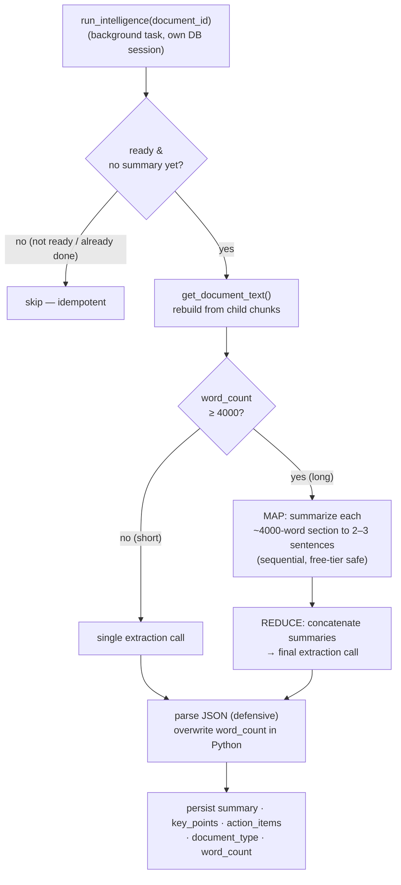

The extraction prompt asks for **only valid JSON** with a fixed shape (`summary`,
`key_points`, `action_items` of `{text, owner, deadline}`, `document_type` ∈
`policy|meeting_notes|technical|other`, `word_count`). Parsing is **defensive**:
`_strip_code_fences()` removes a ```` ```json ```` fence the model may add despite
instructions, and a `JSONDecodeError` degrades gracefully (the raw text becomes the
summary, the rest falls back to safe empties) rather than crashing — a background task
must never re-raise.

**Idempotency.** `run_intelligence` skips if the document already has a summary, so the
endpoint is safe to call repeatedly and never re-spends Gemini quota.

**Endpoints (`routers/intelligence.py`):**

| Method & path | Purpose | Behavior |
|---|---|---|
| `POST /intelligence/{document_id}` | Trigger or return cached | Returns **`200` + the result** if intelligence already exists (idempotent), or **`202` + a "started" message** if it scheduled generation as a background task. `400` if the doc is still processing. |
| `GET /intelligence/{document_id}` | Fetch the result | `404` until generated (`summary` is the sentinel for "done"). |

Both funnel through `_load_authorized_document()`, which enforces `can_access_document()`
— so a `personal` document's intelligence is visible only to its uploader, never to an
admin.

### 5.3 Meeting Assistant

**Purpose.** Turn a raw meeting transcript into structured output — summary, decisions,
owned action items, participants, an estimated duration, and open follow-up questions —
in a single call. A stretch feature, text-only, with no persistence (the result is
ephemeral; the caller displays or saves it).

**How it works (`services/meeting_service.py`).** A single Gemini call with a strict
prompt that demands a JSON object with exactly seven keys. Action items here are richer
than document-intelligence ones — each carries a `priority` of `high`/`medium`/`low` in
addition to `text`, `owner`, and `deadline`. Robustness mirrors the intelligence path:
`_safe_parse()` strips markdown fences and validates with Pydantic, falling back to a
minimal valid `MeetingResponse` rather than `500`-ing on a formatting slip. Transcripts
longer than `_MAX_WORDS = 6000` (≈ 8000 tokens) are truncated to stay within the
free-tier per-request limit, and a note is appended to the summary so the user knows.

**Endpoints (`routers/meeting.py`):**

| Method & path | Purpose | Behavior |
|---|---|---|
| `POST /meeting/process` | Analyze pasted transcript text | Takes `{transcript, title?}`, returns the structured `MeetingResponse`. |
| `POST /meeting/upload` | Analyze an uploaded file | Accepts `.txt` (decoded UTF-8, lenient) or `.pdf` (reusing the ingestion `parse_pdf`, joined across pages); `415` for anything else, `400` if no text extracts. Uses the filename as the meeting title. |

The division of labor is clean: the **router owns file extraction**, the **service owns
intelligence extraction** — so `/upload` reuses `process_transcript()` (and `parse_pdf`)
with no duplication.

### 5.4 Document Search

**Purpose.** A fast semantic search across the documents a user is allowed to see — for
finding *where* something is, as opposed to chat's *answering* it.

**How it works (`GET /documents/search`, `routers/documents.py`).** It is the dense
retrieval path (Section 3.2) used directly: embed the query, run **one** dense Qdrant
search under the **same 3-tier visibility filter** chat uses (so search honors
company/department/personal access identically), retrieve a wider pool of 30 candidates,
then group results to **at most 2 chunks per document** before returning the top *N*
(default 10). The preview is the first 200 characters of `parent_text` (note: `child_text`
is not stored in the Qdrant payload), and the cosine score is rounded for display. A user
with no department gets an empty list — there is no access boundary to scope them to.

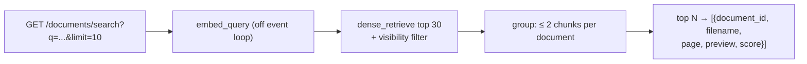

### 5.5 Conversation History

**Purpose.** Persist conversations so a user can return to them, and give the chat
multi-turn memory so follow-up questions ("and what about for managers?") work.

**How it works.** A `ChatSession` groups a conversation; each `ChatMessage` is one turn
(Section 2.1). Two mechanisms matter:

- **Multi-turn context.** Before saving a new user message, the chat handler loads the
  most recent `HISTORY_LIMIT = 4` messages (newest-first, then reversed to chronological)
  and passes them to the prompt builder, which replays the last `MAX_HISTORY_TURNS = 4`
  turns as `Human:`/`Assistant:` lines (Section 4.1). Loading *before* saving the new
  message keeps the current question out of its own context. Four turns bounds the
  context window and free-tier token cost while preserving conversational flow.
- **Auto-titling.** A new session's title is generated from its first question by a
  best-effort second Gemini call, falling back to the first words of the question
  (Section 4.3).

**Endpoints (`routers/chat.py`):**

| Method & path | Purpose | Behavior |
|---|---|---|
| `GET /chat/sessions` | List the user's conversations | Most-recently-active first (by `updated_at`). Each card carries a `message_count` (a grouped sub-query, left-joined so a zero-message session still appears) and a `preview` (the first user message, via a correlated sub-query). |
| `GET /chat/sessions/{id}/messages` | Full transcript | Oldest-first (reading order). Owner-only (`403` otherwise). |
| `DELETE /chat/sessions/{id}` | Delete a conversation | Owner-only. Direct SQL deletes; DB-level FK behavior handles the rest — `chat_messages` **CASCADE**, `query_logs` **SET NULL** (the analytics rows survive, Section 2.1). |

(`POST /chat/query`, the streaming ask endpoint, is documented in Sections 3 and 4.)

### 5.6 Analytics Dashboard

**Purpose.** Give administrators a read-only view of how the platform is used — query
volume, what people ask, what goes unanswered, which documents are largest, trends over
time, and per-department activity. Every endpoint requires `require_admin` (Section 4.5),
so a non-admin is rejected at the dependency before any query runs. The data source is
the denormalized `query_logs` table (Section 2.1) plus `documents`/`users`/`departments`.

**The six endpoints (`routers/analytics.py`):**

| Endpoint | What it returns | Where the data comes from |
|---|---|---|
| `GET /analytics/overview` | Headline cards: total / answered / unanswered queries, ready documents, active users, departments, average response time (ms), and **average faithfulness** | Scalar aggregates over `query_logs`, `documents` (status `ready`), `users` (active), `departments`. |
| `GET /analytics/top-queries` | Most-repeated question topics, with a count and last-asked time | Group by the **first 60 characters** of `query_text` (a cheap topic proxy), ordered by count. |
| `GET /analytics/unanswered` | Recent questions the model couldn't answer | `query_logs` where `answered == False`, joined to the department name, newest first. This is the demand signal for "what documents are missing." |
| `GET /analytics/document-usage` | Documents ranked by `chunk_count` (a size/complexity proxy) | `documents` with status `ready`. The comment notes true retrieval-hit counts would require parsing `ChatMessage.sources` JSONB; the `chunk_count` proxy is free and good enough for an overview. |
| `GET /analytics/queries-over-time` | Daily query counts for the last 30 days | `query_logs` grouped by date, then **zero-filled** in Python across the full 30-day window so the chart has no gaps. |
| `GET /analytics/department-activity` | Per-department query, document, and user counts | **Three separate `GROUP BY` aggregates stitched in Python** — deliberately *not* a single three-way join, which would multiply one-to-many row counts and inflate the numbers. |

The `avg_faithfulness` card is worth a note: it averages `query_logs.faithfulness_score`,
which is populated by the offline RAGAS evaluation (Section 7), not at query time — so it
reflects benchmark quality, not live per-query scoring.

### 5.7 Admin Panel

**Purpose.** Let an admin manage the two things that drive access control: who the users
are (and their roles) and what departments exist.

**How it works (`routers/admin.py`).** All endpoints are `require_admin`-gated and exist
to back the frontend admin dashboard rather than as a public API. Queries are written to
avoid N+1 patterns — a single join for user→department names, a single grouped count for
members-per-department.

**Endpoints:**

| Method & path | Purpose | Behavior |
|---|---|---|
| `GET /admin/users` | All users with their department name | One outer join (cheaper than N dept lookups); `department_name` is set manually since it isn't an ORM column. |
| `GET /admin/departments` | All departments with member counts | One grouped count query mapped onto each department (avoids N+1). |
| `PATCH /admin/users/{user_id}/role` | Promote/demote a user | Validates the role ∈ `{admin, user, viewer}` (`422` otherwise), `404` if the user is missing, and **guards against an admin stripping their own admin role** (`400`) — which would lock them out of the dashboard. |

The own-role guard is a small but important safety rail: role changes are the one admin
action that can revoke the actor's *own* access, so it is the one place the panel refuses
an otherwise-valid operation.

---

## 6. Frontend Architecture

The frontend is a Next.js 15 application that provides every user-facing surface — the
landing page, authentication and onboarding, chat, documents, conversation history, the
meeting assistant, and the admin dashboard. It obeys one hard architectural rule from
`CLAUDE.md`: **the frontend never touches a database**. It talks only to the FastAPI
backend over HTTP, through a single client module (`lib/api.ts`). Everything
security-relevant is enforced on the server; the client's job is presentation.

### 6.1 Next.js 15 App Router Structure

The app uses the **App Router** (file-system routing under `app/`), React 19, and React
Server Components by default, with `"use client"` opting individual interactive trees
into client rendering. The route tree:

```text
app/
├── layout.tsx              # root layout: fonts, <ThemeProvider>, global CSS
├── globals.css             # design tokens + Tailwind v4 wiring (Section 6.2)
├── page.tsx                # public landing page (Nav · Hero · TerminalDemo · Features · Footer)
├── login/page.tsx          # auth + two-step onboarding (sign in / sign up)
└── (app)/                  # route GROUP — the authenticated application shell
    ├── layout.tsx          # sidebar + auth gate + keyboard shortcuts + ToastProvider
    ├── chat/page.tsx       # the chat centerpiece (SSE streaming)
    ├── conversations/page.tsx
    ├── documents/page.tsx
    ├── documents/[docId]/page.tsx   # per-document view + intelligence
    ├── meeting/page.tsx
    └── admin/page.tsx
```

The `(app)` parentheses make a **route group**: it wraps every authenticated page in a
shared layout (the sidebar, the auth gate, global keyboard shortcuts, the toast
provider) **without** adding an `/app` URL segment — so the chat page is at `/chat`, not
`/app/chat`. The group's `layout.tsx` is the application shell; the public landing and
login pages sit outside it and render without the sidebar.

**The client/server split.** Pages that stream, hold local state, or read the browser
(`localStorage`, `window`) are client components (`"use client"`): the entire `(app)`
shell, chat, login, and the interactive landing pieces. The root layout and the landing
page composition are server components. Two Next-15-specific details show up in the
code: `useSearchParams()` (used by chat to read `?session=` and `?doc=`) must be wrapped
in a `<Suspense>` boundary for static rendering, which the chat page does; and the
theme is applied via `next-themes` with `attribute="class"`, toggling a `.dark` class on
`<html>`.

### 6.2 The Design System — Ink, Paper, Amber

The visual design is governed entirely by `DESIGN.md`, and the implementation follows it
precisely. The brand voice is *"a calm library with an engine room underneath"*,
expressed through three typefaces and a tightly constrained palette.

**Three voices, three typefaces** (loaded via `next/font/google`, all free):

- **Fraunces** (serif) — the "wisdom" voice: headlines, the wordmark, section titles.
- **Inter** (sans) — body and UI. Weights 400 and 500 only, never 600/700.
- **JetBrains Mono** (mono) — the "machinery" voice: the terminal demo, pipeline trace
  lines, kicker labels, metadata chips.

**Tokens, not hex.** Every color is a CSS variable defined on `:root`/`.light` and
`.dark` in `globals.css`, wired into Tailwind v4 via `@theme inline` so a utility like
`bg-main` emits `var(--bg-main)` and re-resolves when the theme flips. Components
reference tokens (`bg-card`, `text-primary`, `border-border`, `bg-accent`), never raw
hex. The palette has two parts:

| Group | Examples | Behavior |
|-------|----------|----------|
| **Theme-dependent** | `--bg-main`, `--bg-card`, `--text-primary`, `--border`, `--chip-bg` | Flip between light ("paper") and dark ("ink") values. |
| **Constants** (identical in both modes) | `--ink` `#211e19` (sidebar), `--terminal` `#1f1c17`, **`--accent` `#e8c87e`** (amber), `--paper` `#f5f1e8` | Never themed. The sidebar is ink in *both* modes; amber is *the* accent. |

**Hard rules the code honors:** amber `#e8c87e` is the **only** accent color anywhere;
no purple, no gradients, no glassmorphism, no drop shadows (the single allowed "shadow"
is the terminal's solid ring). These constraints are visible throughout the components —
for example the sidebar is always `bg-ink`, the user pill's admin badge is the one amber
fill, and the citation chips and the trace line use the chip/muted tokens.

**The signature trace line.** Under every *grounded* AI answer, `ChatMessage.tsx` renders
a JetBrains-Mono microline:

```text
hybrid → rrf → rerank(5) · 287ms
```

This is the design system's signature detail — it surfaces the actual retrieval pipeline
(Section 3) and the measured latency beneath the answer, making the "engine room"
visible. It appears only when the answer has sources, reinforcing the citation-grounding
ethos visually.

**Motion.** Minimal, meaningful, and always guarded by `prefers-reduced-motion`:
page-load rise, the terminal's char-by-char typing on the landing page, and hover/active
micro-states. No scroll-jacking, parallax, or animation libraries — pure CSS keyframes
and a few lines of vanilla JS, exactly as `DESIGN.md` mandates.

### 6.3 The API Layer & SWR Caching

**One module owns all backend calls.** `lib/api.ts` is the single place every HTTP call
lives. It centralizes three cross-cutting concerns so no caller repeats them:

1. **Bearer-token injection.** `authHeaders()` reads the JWT from `localStorage` and adds
   `Authorization: Bearer <token>` to every request (opt-out for multipart uploads, where
   the browser must set its own boundary-carrying `Content-Type`).
2. **Uniform error handling.** `handle<T>()` turns any non-OK response into a typed
   `ApiError` carrying the HTTP status and the backend's `detail` message, so the UI can
   show the real message ("Incorrect email or password").
3. **401 auto-logout.** A `401` clears the token and redirects to `/login` — the token is
   missing, expired, or forged, and the user must re-authenticate.

**Token handling is display-only on the client.** `lib/auth.ts` stores the JWT in
`localStorage` and *decodes* (but does **not** verify) its payload to render the user's
name, role, and department before a `getMe()` round-trip. The file's header comment is
explicit that this decode is never trusted for access control — the backend verifies the
signature and expiry on every request. `isLoggedIn()` is a display gate (checks `exp`),
not a security boundary.

**The SSE exception.** Chat does *not* go through the normal JSON helper, because the
streaming endpoint is a `POST` with a bearer header — and the browser's native
`EventSource` can only do unauthenticated `GET`s. So `queryChat()` reads the SSE stream
off `fetch`'s `ReadableStream` by hand: it decodes bytes, splits on the `\n\n` frame
delimiter, dispatches each `data:` frame to an `onToken` callback, and recognizes the
`[DONE]` / `[ERROR]` sentinels (Section 4.3). It returns an `AbortController` so an
in-flight answer can be cancelled.

**SWR for cache-first reads.** `lib/hooks.ts` wraps the read endpoints in
[SWR](https://swr.vercel.app/) hooks, so returning to a page renders the last-known data
*instantly* from a module-level cache while a fresh copy revalidates in the background.
The hooks encode sensible per-resource policies:

| Hook | Endpoint | Revalidation policy |
|------|----------|---------------------|
| `useSessions()` | `GET /chat/sessions` | Background refresh every 30s (sidebar history). |
| `useDocuments(status?)` | `GET /documents` | **Adaptive**: polls every 5s *only while* a document is still `processing`, else 30s — and raises a toast on a `processing → ready`/`failed` transition (deduplicated by a module-level guard so it fires once). |
| `useDepartments()` | `GET /departments` | No focus/reconnect revalidation (departments rarely change). |
| `useMe()` | `GET /auth/me` | Fetched once, cached for the session. |
| `useAnalyticsOverview()` | `GET /analytics/overview` | Refresh every 60s. |

The adaptive document polling is a small but nice piece of engineering: it tightens the
loop only when something is actually in flight, so the app does not burn API calls once
every document is ready, and it surfaces completion as a toast even to a user who has
navigated away to the chat page.

### 6.4 Key Screens & Their Data Flows

**The application shell (`(app)/layout.tsx`).** A resizable, collapsible **ink sidebar**
present on every authenticated page. It hosts the wordmark, a search box (⌘K), the
primary nav (Chat, Conversations, Documents, Upload, Meeting, and — admins only — Admin),
the last 8 chat sessions (from the shared `useSessions` cache), a "new chat" button, and
a user pill showing the avatar initial, name, role badge, and department. It also owns
the **auth gate** (redirect to `/login` if not logged in), persists collapse/width state
to `localStorage`, and registers the **global keyboard shortcuts** (`⌘K` focus search,
`⌘N` new chat, `⌘/` help, `Esc` to close) via `useKeyboardShortcuts`. Role gating is
visual here (the Admin link shows only for `role === "admin"`), with the real
enforcement on the server.

**Login & onboarding (`login/page.tsx`).** Implements the two-step onboarding of Section
5.1 as a single screen with a `mode` (sign in / sign up) and a `step` (1: credentials,
2: department). On sign-up it registers, saves the returned token (needed to call the
authenticated `GET /departments`), then shows the department picker — with an admin-only
"create a new department" inline form (a non-admin would get a `403`, so the toggle is
hidden for them). Step 2 calls `updateMe()` and saves the **fresh** token before
navigating, so the client's JWT carries the new `department_id` immediately.

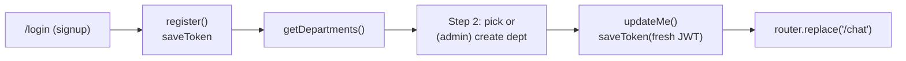

**Chat (`(app)/chat/page.tsx`) — the centerpiece.** A streaming conversation view. On
send, it optimistically appends the user bubble and an empty streaming assistant bubble,
then calls `queryChat()`; tokens accumulate into the assistant bubble live via the
`onToken` callback, `onDone` stamps the wall-clock latency (the trace line), and
`finalize()` re-fetches the persisted message to attach the server-resolved citation
sources. It reads `?session=` to load an existing conversation's messages and `?doc=` to
**scope** the whole conversation to one document (passed through to the backend's
`document_id` retrieval narrowing, Section 3.1), showing a dismissible document chip in
the topbar. Answers render through `ChatMessage.tsx`, which strips `[Source: N]` markers
into amber **citation chips**, renders the prose as GitHub-flavored Markdown
(`react-markdown` + `remark-gfm`), shows a per-source `filename · p.N` row, and the
signature trace line. The empty state shows a time-based greeting and suggestion chips.

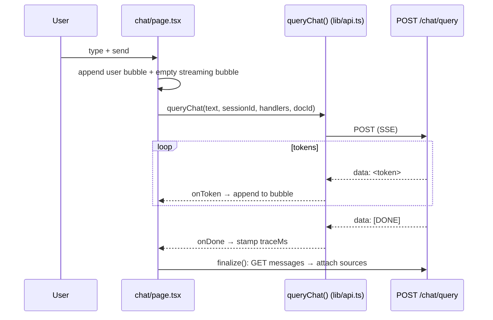

**Documents (`(app)/documents/page.tsx`, `[docId]/page.tsx`).** A list/upload surface
backed by `useDocuments()` (with the adaptive polling and ready/failed toasts above) and
a per-document detail page that triggers and displays **document intelligence** (Section
5.2). Upload sends multipart to `POST /documents/upload` with the chosen visibility tier.

**Other screens.** **Conversations** (`/conversations`) lists and manages chat sessions
(`useSessions`, delete). **Meeting** (`/meeting`) provides the paste-or-upload transcript
analyzer (Section 5.3). **Admin** (`/admin`) is the admin-gated dashboard rendering the
six analytics endpoints (via Recharts) and the user/department management tables (Section
5.6–5.7). The **landing page** (`/`) is the public marketing surface composed of Nav,
Hero, the typing TerminalDemo, the feature band, and Footer, exactly per `DESIGN.md §7`.

A small cross-cutting nicety: `lib/exportChat.ts` exports the loaded conversation to PDF
via the browser's print path, and `lib/useToast.ts` provides the toast notifications that
the document-status transitions raise.

---

## 7. Evaluation & Research

Pragya's research contribution is a **controlled comparison** of the three retrieval
configurations from Section 3 — dense, hybrid, and hybrid + reranking — over one fixed
corpus and a fixed set of ground-truth questions, scored with the RAGAS framework. The
harness lives in `backend/evaluation/`; the committed results are in
`backend/evaluation/final_results.json`. This section reports the methodology and the
real numbers in full, including the results that did *not* match the intuitive
hypothesis.

### 7.1 RAGAS Methodology

[RAGAS](https://docs.ragas.io/) ("Retrieval-Augmented Generation Assessment") scores RAG
outputs with LLM-as-judge metrics. The harness (`ragas_eval.py`) is built around one
decoupling principle: **generation and scoring are separated**, because generation is the
expensive, rate-limited half and scoring must be re-runnable without re-generating.

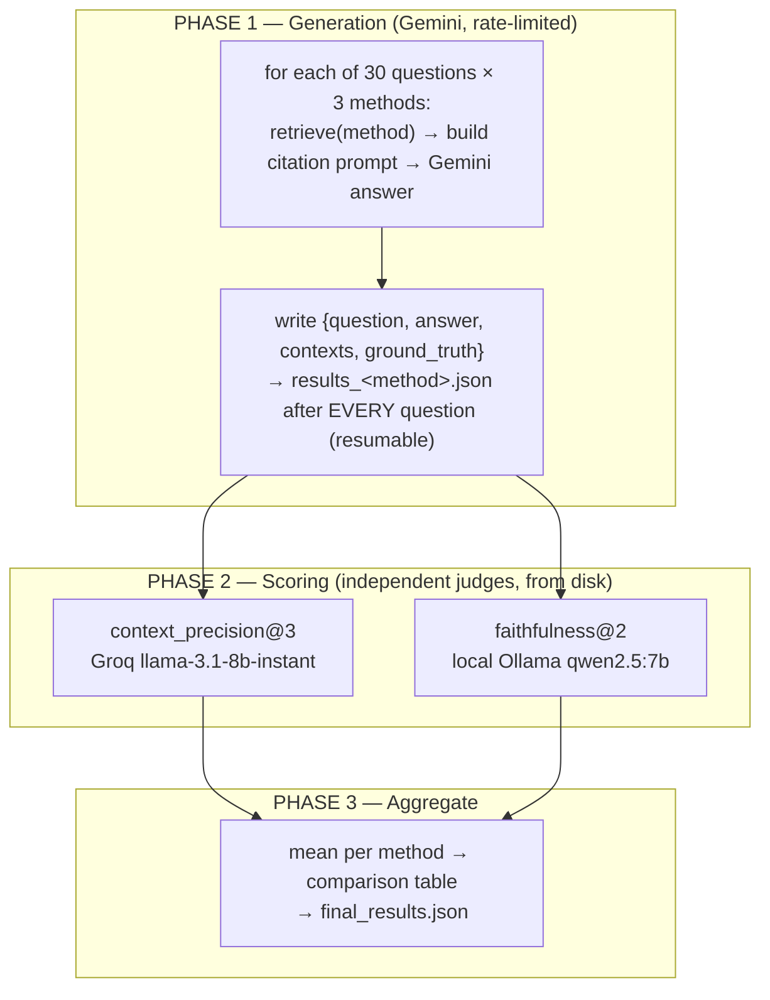

**Phase 1 — generation.** For each question, the harness retrieves with the given method,
builds the *exact same* citation prompt the live app uses (reusing
`build_citation_prompt` and `_dedupe_by_parent`, so the scored contexts are byte-for-byte
what the model saw), and asks Gemini for a grounded answer. Results are written to
`results_<method>.json` **after every question**, so a free-tier `429` or a crash never
re-burns answers already obtained — the phase resumes from disk. Generation is paced
deliberately (4s between calls, a 15s pause every 10 questions, 30s between experiments)
to respect the Gemini free-tier limits, embodying the project's "free-tier discipline."
The test corpus is selected automatically as the department owning the most documents
(the Infovance corpus), and a mock admin user in that department is constructed so the
visibility filter (Section 4.4) admits the corpus exactly as a real query would.

**Phase 2 — scoring.** The saved answers are scored by **two metrics**, each by an
independent judge model (Section 7.3), reading from disk so scoring is re-runnable and
resumable (it skips cells already scored — important because the Groq free tier has a
per-day token cap).

**The two metrics, and why only these two.** RAGAS offers several metrics; the harness
deliberately uses exactly two, with documented reasons for excluding the rest:

- **`context_precision@3`** (kept) — measures how relevant the *retrieved* contexts are
  to the ground truth. This most directly measures **retrieval** quality, which is the
  exact axis the three experiments vary, and it sends one context per judge call so it
  fits the free-tier token budget.
- **`faithfulness@2`** (kept, but moved off Groq — see 7.3) — measures how well the
  *answer* is grounded in the retrieved contexts (the anti-hallucination metric).
- **`answer_relevancy`** (excluded) — requires a real embedding model, which the Groq
  judge has no endpoint for; and it mostly reflects *generation*, which is held constant
  (same LLM, same prompt) across all three experiments, so it cannot separate the
  methods anyway.

**The K-normalization (the fair-comparison control).** As foreshadowed in Section 3.6,
the three methods return different numbers of contexts (dense ≈ 8 deduped parents, hybrid
≈ 12, rerank exactly 5). Scoring "all returned contexts" would be an apples-to-oranges
precision over different list lengths. The harness therefore caps scoring to a fixed
**top-3 contexts** for context precision (`SCORING_TOP_K = 3`) and **top-2** for
faithfulness (`FAITHFULNESS_TOP_K = 2`), turning the comparison into a clean precision@3 /
faithfulness@2 across all three methods. The cited block is always `[Source: 1]` (the top
context), so the relevant context is never capped out.

### 7.2 The 30-Question Benchmark Set

The benchmark (`test_questions.py`) is **30 ground-truth question/answer pairs** authored
directly from the six core Infovance documents. Every question is answerable from the
document text — no invented facts — because RAGAS metrics are only meaningful when the
ground truth is actually present in the searched corpus. Each item carries an `id`,
`question`, `ground_truth`, `source_doc`, and `category`.

> **Divergence callout — question count.** `CLAUDE.md §10` describes "50 fixed test
> questions." The implemented and committed benchmark contains **30**. This report uses
> the real number throughout. Thirty questions across seven categories (≥ 4 per source
> document) is a defensible benchmark size for a single-corpus comparison; the gap from
> the planned 50 is noted honestly.

**Category breakdown:**

| Category | Source document | # Questions |
|----------|-----------------|:-----------:|
| `hr` | HR_Leave_Policy_2025 | 5 |
| `it_security` | IT_Security_Policy_2025 | 4 |
| `it_helpdesk` | IT_Helpdesk_SOP | 4 |
| `finance` | Finance_Expense_Reimbursement_Policy | 5 |
| `engineering` | Engineering_Team_Handbook | 4 |
| `onboarding` | Employee_Onboarding_Guide | 4 |
| `cross_document` | *(two documents combined)* | 4 |
| **Total** | | **30** |

The **cross-document** category is the most demanding by design: each question pairs two
facts that each live in only *one* document, so a correct answer genuinely requires
retrieving from **two different documents** at once — a real test of retrieval breadth,
not just single-passage lookup.

**Representative questions** (verbatim from the set):

- *hr (Q1):* "How many casual leaves are employees entitled to per year?" → ground truth:
  *12 days of Casual Leave per leave year; unused lapses, not carried forward or encashed.*
- *it_security (Q6):* "What is the minimum password length, and how often must passwords
  be rotated?" → *minimum 12 characters, rotated every 90 days (prompt at day 83, enforced
  at day 90).*
- *finance (Q15):* "Who is the approving authority for an expense claim above INR 50,000?"
  → *the CFO* (with the lower tiers also specified).
- *cross_document (Q27):* "How many consecutive failed login attempts will lock an
  account, and … what ticket priority should they raise …?" → combines the Security Policy
  (five attempts) **and** the Helpdesk SOP (a P2 ticket).

### 7.3 The Two-Independent-Judge Design

The single most important methodological safeguard is that **no model grades its own
output**. If Gemini both generated an answer and judged it, self-evaluation bias would
inflate the scores and weaken any claim the study makes. So the harness uses **three
different models** across generation and scoring:

| Role | Model | Why this model |
|------|-------|----------------|
| **Generator** | Gemini `gemini-3.1-flash-lite` | Fast, free-tier-friendly; the system's real chat model. |
| **Context-precision judge** | Groq `llama-3.1-8b-instant` | Independent of the generator; one context per call fits the Groq free-tier token budget. |
| **Faithfulness judge** | **Local** Ollama `qwen2.5:7b` | Independent of the generator; runs locally with no rate limit. |

Both judges differ from the generator, so there is **no self-evaluation bias** on either
metric — the design's central claim.

**Why faithfulness moved to a local model — an honest engineering story.** Faithfulness
could not run on the Groq free tier, and the harness comments document exactly why,
confirmed empirically: faithfulness packs *all* retrieved contexts into a single
natural-language-inference call (~6–12k tokens), but the Groq free tier caps a request at
6000 tokens-per-minute, so the call was rejected with HTTP 413; and `llama-3.1-8b` was too
weak to reliably emit the parseable JSON faithfulness's statement-extraction step needs.
The fix was to run faithfulness on a **local** `qwen2.5:7b` via Ollama — no token limit,
clean JSON, and still independent of the generator. Even this required care: Ollama
defaults to a ~4k context window, which a top-2 prompt of two ~2k-token parents overflows,
sending the model into a runaway generation; the harness sets `num_ctx = 8192` and caps
`num_predict = 2048` so even a degenerate generation terminates, plus a hard 300s
per-question timeout (abandon → NaN, continue).

### 7.4 Results

The headline comparison, from `final_results.json` (means across the 30 questions;
context precision is precision@3 by Groq, faithfulness is @2 by local qwen2.5):

| Method | Faithfulness | Context Precision | **Average** | Cells scored |
|--------|:------------:|:-----------------:|:-----------:|:------------:|
| **Dense (A)** | 0.873 | 0.936 | **0.905** | 30 / 30 |
| **Hybrid (B)** | 0.886 | 0.928 | **0.907** | 29 / 30 |
| **Hybrid + Rerank (C)** | 0.750 | 0.900 | **0.825** | 30 / 30 |

A visual rendering of the same data (bars on a zoomed 0.70–0.95 scale to make the
differences legible):

```text
FAITHFULNESS (anti-hallucination)            scale 0.70 ───────────── 0.95
  Dense (A)            █████████████████·········  0.873
  Hybrid (B)           ███████████████████·······  0.886
  Hybrid+Rerank (C)    █████·····················  0.750   ← sharp drop

CONTEXT PRECISION@3 (retrieval relevance)    scale 0.70 ───────────── 0.95
  Dense (A)            ████████████████████████··  0.936
  Hybrid (B)           ███████████████████████···  0.928
  Hybrid+Rerank (C)    ████████████████████······  0.900

AVERAGE OF THE TWO METRICS
  Dense (A)            0.905   ▏▏▏▏▏▏▏▏▏▏ (near-tie)
  Hybrid (B)           0.907   ▏▏▏▏▏▏▏▏▏▏ (best)
  Hybrid+Rerank (C)    0.825   ▏▏▏▏▏▏▏     (worst)
```

The same numbers, optionally rendered as a grouped bar chart:

```mermaid
xychart-beta
    title "RAGAS scores by retrieval method (higher is better)"
    x-axis ["Dense (A)", "Hybrid (B)", "Hybrid+Rerank (C)"]
    y-axis "Score" 0.70 --> 1.00
    bar "Faithfulness" [0.873, 0.886, 0.750]
    bar "Context Precision" [0.936, 0.928, 0.900]
```

**The A→C change, per metric:** faithfulness **−0.123** (0.873 → 0.750) and context
precision **−0.036** (0.936 → 0.900). Adding the full reranking stage moved *both* metrics
in the **wrong** direction on this corpus.

### 7.5 Honest Findings & Limitations

**Finding 1 — Hybrid is best, but only barely, and dense is essentially tied.** Hybrid (B)
takes the top average (0.907) over dense (0.905) — a difference of **0.002**, well within
noise. The honest interpretation is that on this corpus, **adding the sparse channel
barely changed anything**. This is exactly what Section 2.8 predicts: the sparse vectors do
not align between ingestion and query (index-space mismatch + per-process hash salting), so
the "hybrid" run is effectively dense retrieval fused with a near-empty list. The fusion
machinery is correct; it has almost nothing to fuse. A working sparse channel is the single
change most likely to separate B from A — and is recorded as future work.

**Finding 2 — Reranking *degraded* quality, via over-pruning.** The counter-intuitive
headline: the most elaborate pipeline (C) scored **lowest**, and the damage is concentrated
in **faithfulness**, which fell from ~0.87–0.89 to **0.75**. The most plausible mechanism is
**over-pruning** — by aggressively cutting to a top-5 of parents, the cross-encoder
sometimes drops a context block the answer actually needed; an answer missing one of its
supporting sources is then judged less faithful. The cross-encoder is a powerful tool, but
on a small, clean, single-domain corpus where dense retrieval is already precise, its
pruning removes more signal than its reranking adds. This is the report's most useful
result: **more pipeline is not automatically better**, and it took a real evaluation to
show it.

**Finding 3 — The retrieval differences are small because the corpus is easy.** All three
methods score 0.90+ on context precision and ≥ 0.75 on faithfulness. Six well-structured
policy documents with distinct vocabularies are a relatively easy retrieval target; dense
embeddings alone handle them well, leaving little headroom for hybrid or reranking to
demonstrate value. The methods would likely separate more on a larger, noisier, more
overlapping corpus — a direction for future evaluation.

**Limitations, stated plainly:**

- **The sparse channel is non-functional** (Section 2.8), so "hybrid" here is not a fully
  realized hybrid. The B-vs-A comparison should be read with that caveat.
- **One faithfulness cell is missing for hybrid** (29/30 scored — one question timed out or
  errored on the local 7B and was recorded as NaN, then excluded from the mean), so hybrid's
  faithfulness is a mean over 29, not 30. The harness records this honestly rather than
  imputing a value.
- **The K-asymmetry** is controlled by capping to precision@3 / faithfulness@2, but the
  methods still natively return different context counts; the cap is a normalization, not a
  perfect equalization.
- **Judges are 7–8B models.** Independent of the generator (the key property), but smaller
  than the generator and than a frontier judge would be; absolute scores would shift with a
  stronger judge, though the *relative* ordering of the three methods is the load-bearing
  result.
- **Single corpus, single run.** Thirty questions over six documents, one generation pass.
  The findings are directional, not statistically powered; confidence intervals over
  multiple runs would strengthen any publication.

**What the study contributes.** Despite the limitations, the evaluation does something many
RAG write-ups do not: it runs a genuine controlled comparison with bias-controlled judges
and **reports a negative result honestly** — that the reranker hurt on this corpus, and that
the sparse channel (as implemented) added nothing. For an internship project aimed at a
research venue, demonstrating the *discipline* to find and report those results is as
valuable as a clean win would have been.

---

## 8. Engineering Journey & Appendices

This closing section records *how* Pragya was built — the chronological module order and
the real bugs found and fixed along the way — then states known limitations and future
work, deployment notes, and reference appendices.

### 8.1 The Chronological Build & Key Bugs

**The disciplined build order.** Pragya was built one module per working session, in a
fixed dependency order (`CLAUDE.md §9`), with each module tested via the interactive
`/docs` (or the UI) and git-committed before the next began:

```mermaid
flowchart LR
    F["1 · Foundation<br/>config · DB · Qdrant<br/>models · health"] --> A["2 · Auth + RBAC<br/>JWT · bcrypt · roles"]
    A --> I["3 · Ingestion<br/>parse · chunk · embed · upsert"]
    I --> R["4 · RAG chat<br/>dense → +BM25 → +RRF<br/>→ +reranker → SSE"]
    R --> D["5 · Doc intelligence<br/>summary · map-reduce"]
    D --> C["6 · Conversation history<br/>sessions · multi-turn"]
    C --> AN["7 · Analytics<br/>(stretch)"]
    AN --> M["8 · Meeting assistant<br/>(stretch)"]
    M --> E["+ RAGAS evaluation"]
```

The RAG chat module (4) was itself built incrementally — dense retrieval first, then the
BM25 sparse channel, then RRF fusion, then the cross-encoder reranker — which is also the
structure of the research comparison. This staged approach is visible in the git history
(e.g. `feat: SWR caching, scoped doc chat, …`, `feat: 3-tier document visibility, meeting
file upload`, `fix: strip boilerplate …, dedupe parent chunks`, `feat: add RAGAS Eval`).

**Key bugs and fixes — real engineering maturity.** Each of the following is a genuine
problem encountered and resolved; several left permanent fingerprints in the code
(pinned versions, migrations, defensive comments):

| Issue | Symptom | Fix |
|-------|---------|-----|
| **Postgres driver / async** | The default `psycopg2` driver is synchronous and cannot back an async SQLAlchemy engine; Neon also mandates SSL. | Use the `postgresql+asyncpg://` driver and pass `connect_args={"ssl": True}` (kept out of the URL to avoid clashing with a `?ssl=` param), plus `pool_pre_ping=True` for Neon's idle-connection drops. |
| **Naïve timestamps → `TIMESTAMPTZ`** | `datetime.utcnow()` is deprecated in 3.12+ and returns *naive* datetimes, causing timezone-ambiguous comparisons (and JWT `exp` drift). | Migration `422a00f8181c` converted every timestamp column to `TIMESTAMPTZ`; a shared `_utcnow()` now returns `datetime.now(timezone.utc)`. |
| **bcrypt / passlib crash** | passlib 1.7.4 reads the removed `bcrypt.__about__.__version__` and crashes on bcrypt ≥ 4.1. | **Pin `bcrypt==4.0.1`** (the last compatible release) in `requirements.txt`. |
| **Groq TPM ceiling** | RAGAS faithfulness packs all contexts into one ~6–12k-token call; the Groq free tier caps a request at 6000 TPM → HTTP 413, and `llama-3.1-8b` couldn't emit parseable JSON for it. | Move faithfulness scoring to a **local** Ollama `qwen2.5:7b` (no rate limit), keeping context precision on Groq. |
| **qwen context overflow** | Ollama defaults to a ~4k window; a top-2 prompt of two ~2k-token parents overflowed it, truncating input and triggering a runaway generation that never returned. | Set `num_ctx = 8192`, cap `num_predict = 2048`, and add a hard 300s per-question timeout (abandon → NaN, continue). |
| **Sparse vectors added late** | The sparse channel was introduced after documents had already been ingested dense-only, so existing points had no sparse vector. | Add `reindex_document` / `POST /documents/reindex-all` (admin) to re-embed and re-upsert with dense **+** sparse vectors, reusing stored `qdrant_point_id` so updates land in place (also backfilling the `visibility`/`uploaded_by` payload). |
| **Boilerplate contamination** | A repeated letterhead/footer made chunks from *different* documents look semantically similar, diluting embeddings and blunting the reranker. | Add the two-pass `_strip_boilerplate` (frequency + pattern) before chunking (commit `fix: strip boilerplate from ingestion`). |
| **Over-citation / duplicate parents** | Overlapping children mapped to the same parent, so the model over-cited and tokens were wasted. | `_dedupe_by_parent` (first-200-char key), shared by prompt-building and source-extraction (same commit). |
| **Qdrant client API change** | `qdrant-client` 1.18 removed `client.search(...)` and the `NamedVector` request objects. | Switch to `client.query_points(query=..., using="dense"|"sparse")`; documented inline in `retrieval_service.py`. |
| **Embedding model deprecation** | `text-embedding-004` was deprecated 2026-01-14. | Move to `gemini-embedding-001` with Matryoshka truncation 3072 → 768. |

The sparse-channel **index/hash defect** (Section 2.8) is the one significant bug that
remains *open* in the evaluated build; it is documented rather than silently patched so the
Section 7 numbers stay attributable to the system that was actually measured.

### 8.2 Known Limitations & Future Work

| Area | Limitation | Future work |
|------|-----------|-------------|
| **Sparse retrieval** | Ingestion/query hash indices don't align (index space 100k vs 30k; salted `hash()`), so the channel is effectively dead. | Use a stable hash (`hashlib`) with a shared index space, or a learned sparse encoder (SPLADE / FastEmbed BM25). |
| **Faithfulness judge** | A local 7B is weaker than the generator; one cell timed out (NaN). | A paid Groq tier or a frontier judge would restore Groq-side faithfulness and tighten scores. |
| **Reranking** | Degrades faithfulness via over-pruning on this corpus. | Make rerank top-*n* adaptive, or skip reranking when dense confidence is already high. |
| **Scanned PDFs** | Image-only pages are skipped (no text), failing the document. | Add OCR (e.g. Tesseract) as an ingestion fallback. |
| **SSE framing** | A token containing a newline technically breaks strict one-frame-per-token SSE. | Emit one `data:` line per line of the token (lossless framing). |
| **Token approximation** | Chunks are sized in words at a 0.75 ratio, not exact model tokens. | Use the model's tokenizer for exact 256/1024-token budgets. |
| **Evaluation power** | Single corpus, 30 questions, one run; 50 were planned. | Larger/noisier corpus, the full 50 questions, multiple runs with confidence intervals, `answer_relevancy` with a real embedding model. |
| **Ops** | Dev CORS is permissive; Qdrant calls are synchronous in an async app; boilerplate regex is corpus-specific. | Restrict CORS in prod; adopt `AsyncQdrantClient` if Qdrant becomes a bottleneck; make boilerplate patterns per-tenant config. |

### 8.3 Deployment Notes

**Components to run:**

- **Backend** — FastAPI via Uvicorn. From the repo root: `uvicorn main:app --reload
  --app-dir backend` (virtualenv at `backend/venv`). Startup validates config, creates
  tables (dev), seeds the 12 departments, and bootstraps the Qdrant collection. Schema in
  production is managed by Alembic (`alembic upgrade head`).
- **Vector DB** — Qdrant in Docker, reachable at `http://localhost:6333` (`QDRANT_URL`).
- **Relational DB** — Neon serverless PostgreSQL (cloud), SSL required.
- **Frontend** — Next.js: `npm run dev` (dev) / `npm run build && npm start` (prod), with
  `NEXT_PUBLIC_API_URL` pointing at the backend.
- **Evaluation only** — a local Ollama running `qwen2.5:7b`, and one or more Groq API
  keys. Not needed to run the product, only the RAGAS harness.

**Liveness:** `GET /health` is an unauthenticated, dependency-free probe returning status,
version, and environment — suitable for Docker health checks.

**Environment variables (`.env`, loaded by `pydantic-settings`):**

| Variable | Purpose | Required |
|----------|---------|:--------:|
| `DATABASE_URL` | Neon Postgres (`postgresql+asyncpg://…`, SSL) | ✓ |
| `GEMINI_API_KEY` | Gemini embeddings + chat | ✓ |
| `GEMINI_CHAT_MODEL` | Chat model id (kept in config, not hardcoded) | ✓ |
| `SECRET_KEY` | JWT signing (64-char hex) | ✓ |
| `QDRANT_URL` / `QDRANT_COLLECTION` | Vector store (`localhost:6333` / `pragya_docs`) | default |
| `GEMINI_EMBEDDING_MODEL` / `GEMINI_EMBEDDING_DIMENSIONS` | `gemini-embedding-001` / `768` | default |
| `ALGORITHM` / `ACCESS_TOKEN_EXPIRE_HOURS` | `HS256` / `8` | default |
| `MAX_UPLOAD_SIZE_MB` / `EMBEDDING_BATCH_SIZE` | `50` / `20` | default |
| `APP_ENV` | `development` (drives SQL echo) | default |
| `GROQ_API_KEY` (`_2`, `_3`) | RAGAS context-precision judge (eval only) | optional |
| `NEXT_PUBLIC_API_URL` | Frontend → backend base URL | frontend |

`validate_settings()` fails fast at startup if any required key is missing or blank — a
crash at boot rather than a cryptic error mid-request.

### 8.4 Appendix A — API Endpoint Reference

All routes are mounted in `main.py`. "Auth" = requires a valid bearer token; "Admin" =
requires `role == "admin"`.

| Method | Path | Auth | Purpose |
|--------|------|:----:|---------|
| `GET` | `/health` | — | Liveness probe (status, version, env). |
| `POST` | `/auth/register` | — | Create account; first user → admin. Returns JWT. |
| `POST` | `/auth/login` | — | Email + password → JWT. |
| `GET` | `/auth/me` | Auth | Current user profile. |
| `PATCH` | `/auth/me` | Auth | Self-assign department (role change admin-only); returns fresh JWT. |
| `POST` | `/departments` | Auth* | Create department (*bootstrap when empty, else admin). |
| `GET` | `/departments` | Auth | List departments. |
| `GET` | `/admin/users` | Admin | All users with department names. |
| `GET` | `/admin/departments` | Admin | Departments with member counts. |
| `PATCH` | `/admin/users/{user_id}/role` | Admin | Change a user's role (own-admin guard). |
| `POST` | `/documents/upload` | Auth | Upload a PDF/DOCX/PPTX (202 + background ingest). |
| `GET` | `/documents` | Auth | List accessible documents (visibility-aware). |
| `GET` | `/documents/search` | Auth | Semantic dense search (visibility-filtered). |
| `POST` | `/documents/reindex-all` | Admin | Re-embed all ready docs (dense + sparse). |
| `POST` | `/documents/{document_id}/reindex` | Auth | Re-index one document. |
| `GET` | `/documents/{document_id}/status` | Auth | Poll ingestion status. |
| `POST` | `/chat/query` | Auth | Ask a question → SSE-streamed grounded answer. |
| `GET` | `/chat/sessions` | Auth | List the user's conversations. |
| `DELETE` | `/chat/sessions/{session_id}` | Auth | Delete a conversation. |
| `GET` | `/chat/sessions/{session_id}/messages` | Auth | Full transcript (owner only). |
| `POST` | `/intelligence/{document_id}` | Auth | Trigger/return document intelligence (200 cached / 202 scheduled). |
| `GET` | `/intelligence/{document_id}` | Auth | Fetch generated intelligence. |
| `GET` | `/analytics/overview` | Admin | Headline metric cards. |
| `GET` | `/analytics/top-queries` | Admin | Most-repeated question topics. |
| `GET` | `/analytics/unanswered` | Admin | Recent unanswered questions. |
| `GET` | `/analytics/document-usage` | Admin | Documents by chunk_count proxy. |
| `GET` | `/analytics/queries-over-time` | Admin | Daily query counts (30 days, zero-filled). |
| `GET` | `/analytics/department-activity` | Admin | Per-department query/doc/user counts. |
| `POST` | `/meeting/process` | Auth | Analyze a pasted transcript. |
| `POST` | `/meeting/upload` | Auth | Analyze an uploaded `.txt`/`.pdf` transcript. |

### 8.5 Appendix B — Glossary

- **RAG (Retrieval-Augmented Generation)** — answering with a language model whose input
  is augmented by passages retrieved from a document corpus, so answers are grounded in
  real sources rather than the model's parametric memory.
- **Embedding** — a fixed-length vector of numbers representing the meaning of a piece of
  text, such that similar meanings have nearby vectors.
- **Dense vector / dense retrieval** — retrieval by embedding similarity (meaning-based);
  Pragya uses 768-dimensional Gemini embeddings compared by cosine similarity.
- **Sparse vector / BM25** — retrieval by keyword overlap; most dimensions are zero, with
  non-zero entries at hashed word indices weighted by term frequency. BM25 is the classic
  keyword-ranking function this approximates.
- **Hybrid retrieval** — combining dense and sparse retrieval to capture both meaning and
  exact keywords.
- **RRF (Reciprocal Rank Fusion)** — a parameter-free method to merge two ranked lists by
  summing `1/(k + rank)` across lists (Pragya uses `k = 60`); rewards items ranked well by
  *both* retrievers.
- **Bi-encoder** — encodes query and document *independently*, then compares vectors
  (cheap; used by dense/sparse retrieval).
- **Cross-encoder** — feeds the (query, document) pair through a transformer *together* for
  a joint relevance score (accurate but expensive; used to rerank).
- **Reranking** — re-scoring a small candidate set with a more accurate (cross-encoder)
  model and keeping the best few.
- **Hierarchical chunking** — splitting a document into small **child** chunks (for precise
  retrieval) nested inside larger **parent** chunks (for richer generation context); Pragya
  retrieves on children and generates from parents.
- **Matryoshka embedding** — an embedding trained so any prefix is itself a valid embedding,
  allowing truncation (3072 → 768) with minimal quality loss.
- **Asymmetric embedding** — embedding queries and documents with different "task type"
  hints so they map into a shared comparison space.
- **Qdrant** — the vector database storing the dense + sparse vectors and access-control
  payload; queried with a department/visibility filter.
- **SSE (Server-Sent Events)** — a one-way HTTP streaming format (`data: …\n\n` frames)
  used to stream answer tokens to the browser.
- **JWT (JSON Web Token)** — a signed, stateless token carrying the user's id, department,
  and role, verified by the backend on every request.
- **RBAC (Role-Based Access Control)** — restricting actions by role (admin/user/viewer)
  and, here, restricting *retrieval* by department/visibility tier.
- **Hallucination** — an LLM producing confident but unsupported content; Pragya guards
  against it by constraining the model to the retrieved context and enforcing citations.
- **RAGAS** — a framework of LLM-as-judge metrics for evaluating RAG systems.
- **Faithfulness** — the degree to which an answer's claims are supported by the retrieved
  contexts (the anti-hallucination metric).
- **Context precision** — the degree to which the *retrieved* contexts are relevant to the
  ground-truth answer (a retrieval-quality metric).
- **NLI (Natural Language Inference)** — judging whether a statement is entailed by a text;
  the mechanism behind the faithfulness metric.

### 8.6 Appendix C — Markdown → LaTeX/PDF Conversion Plan

This report was authored in Markdown for speed, readable diffs, and free GitHub rendering;
the agreed plan is a **one-time conversion of the finished content to hand-tuned LaTeX/PDF**.
The path:

1. **Diagrams.** Pre-render every Mermaid block to a vector image with the Mermaid CLI
   (`mmdc -i diagram.mmd -o diagram.pdf` or `.svg`), then replace the fenced blocks with
   `\includegraphics` figures. Mermaid does not render inside LaTeX, so this pre-render is
   required (it is also why Mermaid was preferred over hand-written TikZ during authoring —
   far faster to iterate).
2. **Math.** The formulas use ```` ```math ```` fenced blocks (GitHub's syntax). For pandoc
   these convert to `$$ … $$` display math with a one-line substitution; the LaTeX is then
   native and high-quality. (The notation was written LaTeX-style precisely so this step is
   mechanical.)
3. **Body, tables, structure.** `pandoc report.md -o report.tex` converts prose, tables,
   lists, and headings to LaTeX cleanly; from there typography, a title page, the auto-numbered
   ToC, captions, and cross-references are hand-tuned, and `xychart`/bar visuals can be upgraded
   to PGFPlots if desired.
4. **Result.** `pandoc … --pdf-engine=xelatex` (or compiling the tuned `.tex`) yields the
   publication-grade PDF, while the Markdown source remains the working reference.

The separate academic paper at `paper/pragya_paper.tex` already lives in LaTeX and can draw
directly on Sections 3 and 7 of this report for its method and results.

---

## Document Complete

All eight phases are written. This master technical report covers Pragya end to end: the
system overview and technology rationale (§1), the data model and ingestion pipeline (§2),
the retrieval research core with full mathematics (§3), generation/citations/access control
(§4), every feature module (§5), the frontend architecture (§6), the RAGAS evaluation with
real results (§7), and the engineering journey with appendices (§8).

*Pragya · प्रज्ञा — every answer, with its source.*
